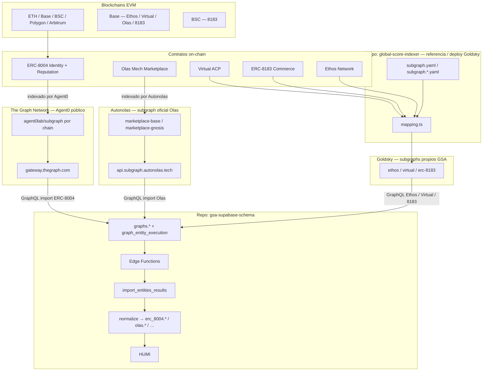
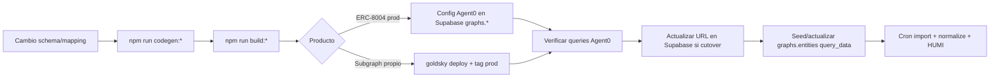

# Arquitectura de grafos — Global Score Agent

**Versión:** julio 2026  
**Audiencia:** ingeniería, producto, agentes de IA  
**Repositorio indexador:** [`global-score-indexer`](https://github.com/GlobalScoreAgent/global-score-indexer) (este repo)  
**Repositorio backend:** `gsa-supabase-schema` (import, normalización, HUMI)

Este documento registra la **arquitectura actual** de subgraphs (The Graph) y su integración con Global Score Agent: plataformas, repositorios, productos desplegados, reglas de negocio y pipeline hacia Postgres/Supabase.

**Importante:** **Ormi 0xGraph ya no es proveedor** en GSA (retirado tras migración completa, jul 2026). Tres fuentes GraphQL activas:

| Fuente | Producto |
|--------|----------|
| **[Agent0](https://github.com/agent0lab/subgraph)** (The Graph Network) | ERC-8004 — ETH, Base, BSC, Polygon, Arbitrum |
| **[Autonolas](https://api.subgraph.autonolas.tech/)** (subgraph oficial Valory) | Olas Mech Marketplace — Base, Gnosis |
| **Goldsky** (subgraphs propios GSA) | Ethos, Virtual ACP, ERC-8183 |

---

## 1. Propósito en el negocio

Global Score Agent (GSA) calcula índices de calidad para agentes autónomos. Los **grafos** son la capa que transforma eventos on-chain en datos consultables vía GraphQL.

| Índice / dominio | Qué aportan los grafos | Qué **no** hacen los grafos |
|------------------|------------------------|-----------------------------|
| **HUMI** (reputación del agente) | Registro ERC-8004, feedback, actividad marketplace (Olas, Virtual, 8183), señales Ethos (fase import) | No calculan el score; solo exponen señales crudas |
| **WAMI** (wallet del owner) | — | Pipeline separado (Alchemy, Moralis, Zerion) |
| **Credibility Score Ethos** | — | Off-chain; el subgraph Ethos indexa señales on-chain únicamente |

**Principio rector:** el subgraph **indexa y estructura**; el backend **normaliza, enlaza y puntúa**.

---

## 2. Vista de sistema (end-to-end)



---

## 3. Plataformas de hosting

GSA usa **tres fuentes** de endpoints GraphQL en producción.

### 3.1 The Graph Network — Agent0 (ERC-8004)

| Aspecto | Detalle |
|---------|---------|
| **Qué es** | Subgraphs **multichain mantenidos por [Agent0](https://github.com/agent0lab/subgraph)** sobre el estándar ERC-8004; desplegados en The Graph decentralized network |
| **Uso en GSA** | **Import diario de agents / feedbacks / feedbackResponses** en ETH, Base, BSC, Polygon, Arbitrum |
| **Endpoint** | `https://gateway.thegraph.com/api/<THE_GRAPH_API_KEY>/subgraphs/id/<SUBGRAPH_ID>` |
| **Auth** | API key de The Graph (`graph.secret` en `graphs.graph` → env en edge) |
| **Pipeline Supabase** | `graphs.*` → edge `graph_entity_execution` → `graphs.normalize_batch_*_erc` |
| **IDs on-chain** | Formato Agent0 `chainId:agentId` (ej. `8453:42`) → canonical GSA `base-42` vía `erc_8004.chains.name_yaml` |
| **Repo GSA** | No despliega estos subgraphs; solo configura URLs en BD + `query_data` en `graphs.entities` |

**Subgraph IDs Agent0 (jul 2026):**

| Chain GSA | Chain ID | Subgraph ID (The Graph) |
|-----------|----------|-------------------------|
| Ethereum (`mainnet`) | `1` | `FV6RR6y13rsnCxBAicKuQEwDp8ioEGiNaWaZUmvr1F8k` |
| Base | `8453` | `43s9hQRurMGjuYnC1r2ZwS6xSQktbFyXMPMqGKUFJojb` |
| BSC | `56` | `D6aWqowLkWqBgcqmpNKXuNikPkob24ADXCciiP8Hvn1K` |
| Polygon (`matic`) | `137` | `9q16PZv1JudvtnCAf44cBoxg82yK9SSsFvrjCY9xnneF` |
| Arbitrum (`arbitrum-one`) | `42161` | `HZ6yKjjbYpkLTXLJBxfe4HWN3jxkLfLNJXh4zeVj1t9L` |

Detalle de campos, queries y mapeo Agent0 → normalize: [`agent0-gsa-field-mapping.md`](agent0-gsa-field-mapping.md).

**Diferencias vs subgraph de referencia en este repo** (código local, no desplegado en prod):

| Capacidad | Agent0 (import prod) | Código GSA en repo (referencia) |
|-----------|----------------------|----------------------------------|
| Metadatos agente | `registrationFile` (IPFS resuelto) | Decodifica `data:application/json;base64` inline |
| Feedback `value` | `BigDecimal` string | Entero on-chain |
| Gas / tx en feedback | No expuesto | `gasUsed`, `txFrom`, `gasPrice`, … |
| Validaciones ERC-8004 | Entidad `Validation` (no importada v1) | No indexado |

### 3.2 Autonolas — Olas Mech Marketplace (oficial)

| Aspecto | Detalle |
|---------|---------|
| **Qué es** | Subgraph **mantenido por [Valory / Autonolas](https://github.com/valory-xyz/autonolas-marketplace)**; proxy público operado por Autonolas |
| **Uso en GSA** | Import de actividad marketplace Olas (mechs, requests, deliveries, karma, balances) en Base y Gnosis |
| **Endpoint Base** | `https://api.subgraph.autonolas.tech/api/proxy/marketplace-base` |
| **Endpoint Gnosis** | `https://api.subgraph.autonolas.tech/api/proxy/marketplace-gnosis` |
| **Pipeline Supabase** | Edges especializadas `graph_olas_mech`, `graph_olas_marketplace_deliveries` + normalize Olas |
| **Repo GSA** | **No despliega** subgraph Olas en prod; `subgraphs/olas-marketplace/` es referencia de entidades y `query_data` |

Contratos y start blocks: [`networks-olas.json`](../networks-olas.json). Spec de entidades GSA: [`olas-marketplace-indexer.md`](olas-marketplace-indexer.md).

### 3.3 Goldsky (subgraphs propios GSA)

Dos proyectos Goldsky (jul 2026):

| Proyecto | Project ID | Uso | Auth `.env` |
|----------|------------|-----|-------------|
| **Productos** | `project_cmma0eekxnc4e01vt9klkbya9` | Ethos, Virtual, ERC-8183 | `GOLDSKY_API_KEY` |
| **ERC-8004 extension** | `project_cmra5abu7bwp901xf5kbz3wqr` | Celo, X Layer, Gnosis | `GOLDSKY_ERC8004_API_KEY` |

Patrón endpoint: `https://api.goldsky.com/api/public/<project_id>/subgraphs/<nombre>/prod/gn`

### 3.4 Ormi 0xGraph — retirado

Ormi fue el proveedor histórico (mar–jun 2026). **Ya no se usa.** Los scripts legacy en `package.json` no ejecutar en operación normal.

### 3.5 Matriz: qué fuente usa cada cosa

| Producto / chain | Fuente GraphQL en **import prod** | Normalización Supabase |
|------------------|-----------------------------------|-------------------------|
| ERC-8004 ETH, Base, BSC, Polygon, Arbitrum | **Agent0** (The Graph) | `graphs.normalize_batch_*_erc` |
| Olas Base | **Autonolas** `marketplace-base` | `graph_olas_*` + normalize Olas |
| Olas Gnosis | **Autonolas** `marketplace-gnosis` | idem |
| Virtual Base | **Goldsky** `virtual-acp-base/prod` | `graphs.*` |
| ERC-8183 Base / BSC | **Goldsky** `erc-8183-commerce-*` | `graphs.*` |
| Ethos Base | **Goldsky** `ethos-network-base/prod` | `graphs.*` |
| ERC-8004 Celo | **Goldsky** `erc-8004-agent-celo/prod` | Subgraph propio (cuenta extension) |
| ERC-8004 X Layer | **Goldsky** `erc-8004-agent-xlayer/prod` | Subgraph propio; IDs `x1-*` |
| ERC-8004 Gnosis | **Goldsky** `erc-8004-agent-gnosis/prod` | Subgraph propio (sin Agent0) |

### 3.6 Criterio de elección de fuente

| Situación | Elección |
|-----------|----------|
| Datos ERC-8004 en chain con subgraph Agent0 | **Agent0** |
| Olas Mech Marketplace | **Autonolas** (subgraph oficial; no self-host) |
| Producto propio GSA (Ethos, Virtual, ERC-8183) | **Goldsky** — deploy desde repo |
| Desarrollo / pruebas locales | Docker Compose (`graph-node`) |

---

## 4. Stack tecnológico

| Capa | Tecnología |
|------|------------|
| Protocolo | [The Graph](https://thegraph.com/) (subgraph spec ≥ 1.3) |
| ERC-8004 prod (5 chains) | Subgraph **Agent0** hosted en The Graph Network |
| Olas Base / Gnosis | Subgraph **Autonolas** oficial (proxy público) |
| Ethos, Virtual, ERC-8183 | Subgraphs propios GSA en **Goldsky** |
| Import backend | Supabase Edge (Deno) + PL/pgSQL (`graphs.*`) |
| Local dev | Docker Compose (`graph-node` + IPFS + Postgres) |

El repo **indexer** mantiene el código fuente de subgraphs propios y referencia ERC-8004. Los subgraphs **Agent0** los mantiene la comunidad Agent0; GSA solo los consume vía gateway. **Ormi ya no es proveedor.**

---

## 5. Repositorio `global-score-indexer`

### 5.1 Estructura lógica

```
global-score-indexer/
├── subgraph.yaml              # ERC-8004 — un manifest, una red por deploy
├── schema.graphql               # Entidades Agent, Feedback, FeedbackResponse
├── src/mapping.ts               # Handlers ERC-8004 raíz
├── abis/
│   ├── agentregistry.json       # Identity + Reputation (misma ABI)
│   ├── olas/
│   ├── virtual/
│   ├── ethos/                   # ABIs proxy/implementación Base
│   └── …
├── subgraphs/
│   ├── olas-marketplace/        # Referencia Olas (prod = Autonolas oficial)
│   ├── virtual-marketplace/     # Base (Goldsky)
│   ├── erc-8183-commerce/       # Base + BSC (Goldsky)
│   └── ethos-network/           # Base (Goldsky)
├── networks.json                # ERC-8004: startBlock, estado (referencia; prod = Agent0)
├── networks-olas.json
├── networks-virtual.json
├── networks-8183.json
├── networks-ethos.json
├── docs/                        # Specs, operaciones, este documento
└── scripts/                     # Cutover Supabase, validación queries
```

### 5.2 Modelo de deploy: un subgraph por chain (y por producto)

No existe un subgraph multichain único. El **mismo código** se despliega N veces cambiando `network` y `startBlock` en el manifest (o usando manifests duales por carpeta).

| Producto | Carpeta | Manifest(s) | Prod / entidades |
|----------|---------|-------------|------------------|
| **ERC-8004** | raíz | `subgraph.yaml` | **Agent0** (referencia local). Entidades: `Agent`, `Feedback`, `FeedbackResponse` |
| **Olas** | `subgraphs/olas-marketplace/` | `subgraph.base.yaml`, `subgraph.gnosis.yaml` | **Autonolas** oficial (código = referencia). Mechs, requests, deliveries, karma |
| **Virtual Marketplace** | `subgraphs/virtual-marketplace/` | `subgraph.base.yaml` | **Goldsky**. Jobs ACP, deliveries, payments, bonding |
| **ERC-8183 Commerce** | `subgraphs/erc-8183-commerce/` | `subgraph.base.yaml`, `subgraph.bsc.yaml` | **Goldsky**. Jobs, statuses, commerce events |
| **Ethos Network** | `subgraphs/ethos-network/` | `subgraph.base.yaml` | **Goldsky**. Profiles, reviews, vouches, markets, broker, bonds, … |

### 5.3 Metadatos por red (`networks*.json`)

Cada archivo JSON es la **fuente operativa** de:

- Direcciones de contrato
- `startBlock` (global o por datasource)
- Nombre de deploy Goldsky (`goldskyDeployName`)
- Campo legacy `ormiDeployName` (histórico, no usar)
- Endpoint GraphQL cuando aplica
- `status`: `live`, `removed`, `migrating`

---

## 6. Catálogo de subgraphs en producción (jul 2026)

### 6.1 ERC-8004 — agentes y feedback

#### A) Producción HUMI — Agent0 (5 chains principales)

Estas chains alimentan **`erc_8004.agents`**, **`registration_feedbacks`** y **`registration_feedback_responses`** vía pipeline `graphs.*` + normalize Agent0.

| Chain | Fuente import | Subgraph ID (The Graph) |
|-------|---------------|-------------------------|
| Ethereum | **Agent0** | `FV6RR6y13rsnCxBAicKuQEwDp8ioEGiNaWaZUmvr1F8k` |
| Base | **Agent0** | `43s9hQRurMGjuYnC1r2ZwS6xSQktbFyXMPMqGKUFJojb` |
| BSC | **Agent0** | `D6aWqowLkWqBgcqmpNKXuNikPkob24ADXCciiP8Hvn1K` |
| Polygon | **Agent0** | `9q16PZv1JudvtnCAf44cBoxg82yK9SSsFvrjCY9xnneF` |
| Arbitrum | **Agent0** | `HZ6yKjjbYpkLTXLJBxfe4HWN3jxkLfLNJXh4zeVj1t9L` |

Entidades importadas: `agents`, `feedbacks`, `feedbackResponses` (`root_query` en `graphs.entities`).  
Orden: agents → feedbacks → feedbackResponses.  
Normalización: `graphs.normalize_batch_agent_erc`, `normalize_batch_feedback_erc`, `normalize_batch_feedback_response_erc`.

**Código en este repo:** el manifest ERC-8004 raíz (`subgraph.yaml`, `src/mapping.ts`) sirve como **referencia de mapping** y para desarrollo local. **No se despliega** a producción; el import HUMI lee Agent0.

**Contratos (CREATE2, mismas en todas las EVM):**

| Registro | Address |
|----------|---------|
| Identity Registry | `0x8004A169FB4a3325136EB29fA0ceB6D2e539a432` |
| Reputation Registry | `0x8004BAa17C55a88189AE136b182e5fdA19dE9b63` |

**Lógica de import Agent0 (producción):**

- Edge `graph_entity_execution` pagina GraphQL Agent0 según `graphs.entities.query_data`.
- Normalize convierte IDs `chainId:…` → slug GSA (`mainnet-509`, `base-42`, …).
- `registrationFile` aporta name/description/image sin job URI en Supabase.
- `value` feedback: escala `BigDecimal` → `on_chain_value` int128.

#### B) ERC-8004 extension — Goldsky (Celo, X Layer, Gnosis)

Chains sin subgraph Agent0 en el pack de producción. Subgraphs propios en cuenta Goldsky `project_cmra5abu7bwp901xf5kbz3wqr`.

| Chain | Deploy | `network` | Endpoint |
|-------|--------|-----------|----------|
| Celo | `erc-8004-agent-celo/prod` | `celo` | `…/erc-8004-agent-celo/prod/gn` |
| X Layer | `erc-8004-agent-xlayer/prod` | `x1` | `…/erc-8004-agent-xlayer/prod/gn` |
| Gnosis | `erc-8004-agent-gnosis/prod` | `gnosis` | `…/erc-8004-agent-gnosis/prod/gn` |

Metadatos: [`networks.json`](../networks.json). Deploy: [`operaciones.md`](operaciones.md) § Goldsky cuenta ERC-8004.

#### C) Optimism — fuera de import prod

Sin Agent0 ni deploy Goldsky activo (jul 2026).

### 6.2 Olas Mech Marketplace

| Chain | Fuente import | Endpoint |
|-------|---------------|----------|
| Base | **Autonolas** (oficial) | `https://api.subgraph.autonolas.tech/api/proxy/marketplace-base` |
| Gnosis | **Autonolas** (oficial) | `https://api.subgraph.autonolas.tech/api/proxy/marketplace-gnosis` |

GSA **no despliega** subgraph Olas. El código en `subgraphs/olas-marketplace/` documenta entidades y queries esperadas para el import. Spec: [`olas-marketplace-indexer.md`](olas-marketplace-indexer.md).

### 6.3 Virtual Marketplace (ACP)

| Chain | Proveedor | Deploy |
|-------|-----------|--------|
| Base | **Goldsky** | `virtual-acp-base/prod` |

Spec: [`virtual-marketplace-indexer.md`](virtual-marketplace-indexer.md). Metadatos: `networks-virtual.json`.

### 6.4 ERC-8183 Agentic Commerce

| Chain | Proveedor | Deploy |
|-------|-----------|--------|
| Base (UFX) | **Goldsky** | `erc-8183-commerce-base/prod` |
| BSC (BNB APEX) | **Goldsky** | `erc-8183-commerce-bsc/prod` |

Spec: [`erc-8183-commerce-indexer.md`](erc-8183-commerce-indexer.md).

### 6.5 Ethos Network (reputación humana / owner)

| Chain | Proveedor | Deploy |
|-------|-----------|--------|
| Base | **Goldsky** | `ethos-network-base/prod` (v1.0.1) |

**Rol en GSA:** enriquecer HUMI vinculando **owner del agente** (wallet ERC-8004) con perfiles Ethos (`EthosProfileAddress`) y handles X (`EthosAttestation`). **No sustituye** datos ERC-8004.

**11 entidades** indexadas; `EthosProjectVote` fuera de v1 (sin eventos on-chain).

- Metadatos: [`networks-ethos.json`](../networks-ethos.json)
- Import futuro: [`ethos-subgraph-entities-query-data.md`](ethos-subgraph-entities-query-data.md)
- Validación queries: `node scripts/validate-ethos-queries.mjs`

---

## 7. Reglas de negocio y diseño del indexador

### 7.1 Start block

- **No** usar genesis de la chain.
- **No** exigir el bloque exacto del deploy del contrato.
- **Sí** usar un bloque en la ventana de **~enero 2026** (despliegue ERC-8004 / lanzamiento del producto en esa red), anterior al primer evento relevante.
- Productos posteriores (Ethos Broker/Bond/Project) pueden usar `startBlock` **por datasource** si desplegaron más tarde.

### 7.2 Identificadores de entidades

Patrón general: prefijo de red + claves on-chain para evitar colisiones multichain.

| Producto | Ejemplo de ID |
|----------|----------------|
| ERC-8004 Agent | `{network}-{agentId}` |
| ERC-8004 Feedback | `{network}-{agentId}-{client}-{feedbackIndex}` |
| Ethos Profile | `{profileId}` (string) |
| ERC-8183 Job | `{network}-{contract}-{jobId}` |

**Regla para agentes de IA:** no cambiar formatos de ID sin migración explícita en backend.

### 7.3 Qué indexar y qué ignorar

| Indexar | Ignorar (por diseño) |
|---------|----------------------|
| Eventos de usuario/protocolo (registro, feedback, trades, vouches) | Fees admin, ownership upgrades, pausas de infra |
| Metadatos on-chain y URIs decodificables | Scores calculados off-chain (Ethos Credibility) |
| Señales con skin in the game (vouches, bonds, slashes) | Ruido de contratos auxiliares (SignatureVerifier, etc.) |

### 7.4 Entidades mutables vs inmutables

Graph CLI reciente exige `@entity(immutable: true|false)`. Entidades con estado que cambia (`archived`, contadores, balances) → **mutable**. Eventos append-only (trades) → **immutable**.

### 7.5 Híbrido on-chain / off-chain

EthosBroker y EthosProject registran creación on-chain; estados como `COMPLETED`, votos de temporada o `isArchived` pueden vivir en **API Ethos v2**. El subgraph documenta solo lo emitido en logs; el doc `query_data` anota limitaciones.

---

## 8. Pipeline downstream — Supabase `graphs.*`

Fuente detallada: [`graphs-schema-import.md`](../../BD_Supabase/gsa-supabase-schema/supabase/docs/graphs-schema-import.md) (repo `gsa-supabase-schema`).

### 8.1 Pipeline ERC-8004 (Agent0)

| Aspecto | Detalle |
|---------|---------|
| **Fuente GraphQL** | **Agent0** (`gateway.thegraph.com`) |
| **Chains** | ETH, Base, BSC, Polygon, Arbitrum |
| **Orquestación** | `graphs.*` + edge `graph_entity_execution` |
| **Normalización** | `graphs.normalize_batch_*_erc` |

Los URLs de **Agent0** viven en `graphs.subgraph.url` (no en `networks.json` del indexer). El pipeline legacy `erc_8004.execution_*` / Ormi **está retirado**.

### 8.2 Separación de responsabilidades

| Capa | Responsabilidad |
|------|-----------------|
| **Subgraph (Agent0 o propio)** | Indexar blockchain → GraphQL |
| **Edge function** | Paginar GraphQL → escribir `raw_json` en staging |
| **Normalización SQL/TS** | `raw_json` → tablas de dominio (`erc_8004.*`, futuro `ethos.*`) |
| **HUMI** | Features agregadas, linking agente ↔ owner ↔ Ethos |

**Principio:** la edge **no normaliza** en la misma invocación; un batch por llamada; watermark incremental entre corridas.

### 8.3 Configuración en Postgres (`graphs.*`)

```
graphs.graph
  └── graphs.subgraph          (URL GraphQL por deployment)
        └── graphs.subgraph_entities   (watermark, incremental/full)
              └── graphs.entities      (root_query, query_data, edge_function)
```

Campos clave de import por entidad:

| Campo | Uso |
|-------|-----|
| `root_query` | Raíz plural GraphQL (`agents`, `ethosProfiles`, …) |
| `query_data` | Selection set multilínea (debe coincidir con schema desplegado) |
| `filter_field` / `order_by_field` | Watermark incremental |
| `batch_size` | Tamaño de página (típ. 500) |
| `edge_function` | `graph_entity_execution` (default) u Olas especializadas |

### 8.4 Orquestación

1. `graphs.monitor_hourly` / cron → activa ejecución diaria.
2. `subgraph_execution` → crea `import_graph` + filas `import_entities`.
3. `entity_execution` → hasta 10 entidades en paralelo vía `net.http_post` a Edge.
4. Edge consulta GraphQL, inserta `import_entities_results` (`processed_status = pending`).
5. `entity_finish` → cierra entidad, actualiza watermarks en `subgraph_entities`.

Normalización ERC-8004: funciones `graphs.normalize_batch_*_erc` — ver [`agent0-gsa-field-mapping.md`](agent0-gsa-field-mapping.md). Ethos: **pendiente** (fase posterior al seed de `graphs.entities`).

### 8.5 Cutover de endpoints

Los URLs de subgraph en producción viven en **BD** (`graphs.subgraph.url`, `erc_8004.chains.graphql_endpoint`), no solo en este repo.

Script de referencia: [`scripts/supabase-goldsky-cutover.sql`](../scripts/supabase-goldsky-cutover.sql).

---

## 9. Flujo operativo (desarrollador)



Runbook completo: [`operaciones.md`](operaciones.md).

---

## 10. Documentación relacionada

| Documento | Contenido |
|-----------|-----------|
| [`negocio.md`](negocio.md) | Propósito HUMI/WAMI, stakeholders |
| [`arquitectura.md`](arquitectura.md) | Detalle técnico ERC-8004 (legacy, ver también este doc) |
| [`operaciones.md`](operaciones.md) | Deploy, Goldsky, errores comunes |
| [`ethos-subgraph-entities-query-data.md`](ethos-subgraph-entities-query-data.md) | Entidades Ethos + `query_data` import |
| [`propuesta-chains-erc8004.md`](propuesta-chains-erc8004.md) | Roadmap chains ERC-8004 |
| [`AGENTS.md`](../AGENTS.md) | Reglas para agentes de IA en el repo |
| [`agent0-gsa-field-mapping.md`](agent0-gsa-field-mapping.md) | Agent0 → normalize; subgraph IDs; queries |
| [`graphs-schema-import.md`](../../BD_Supabase/gsa-supabase-schema/supabase/docs/graphs-schema-import.md) | Pipeline `graphs.*` (Agent0 import) |
| [`erc8004-ormi-subgraph-import-normalization.md`](../../BD_Supabase/gsa-supabase-schema/supabase/docs/erc8004-ormi-subgraph-import-normalization.md) | Pipeline Ormi legacy (**retirado**, referencia histórica) |

---

## 11. Roadmap arquitectónico (fuera del indexador puro)

| Fase | Trabajo | Repo |
|------|---------|------|
| Hecho | Migración ERC-8004 prod Ormi → **Agent0** (5 chains) + `normalize_batch_*_erc` | supabase |
| Hecho | Retirada de Ormi como proveedor | ops |
| Hecho | Subgraph Ethos Base en Goldsky | indexer |
| Hecho | Doc `query_data` Ethos (11 entidades) | indexer |
| Pendiente | Seed `graphs.graph` / `entities` Ethos | supabase |
| Pendiente | Normalización `ethos.*` desde staging | supabase |
| Pendiente | Linking `agent_id` ↔ Ethos profile / X handle | supabase |
| Pendiente | Features HUMI con señales Ethos | supabase |
| Pendiente | Migración ERC-8183 Base a Goldsky (si aún pendiente) | indexer |

---

## 12. Glosario

| Término | Significado |
|---------|-------------|
| **Subgraph** | Índice The Graph: manifest + mapping + schema desplegados en un host |
| **Manifest** | `subgraph.yaml` — datasources, event handlers, startBlock |
| **Mapping** | Código AssemblyScript que transforma logs en entidades |
| **root_query** | Campo raíz GraphQL plural usado en import (`agents`, `ethosProfiles`) |
| **query_data** | Selection set GraphQL guardado en `graphs.entities` |
| **Watermark** | Último valor de `filter_field` importado (`filter_value_next_run`) |
| **Agent0** | Subgraph público ERC-8004 en The Graph Network (agent0lab) |
| **Gateway** | `gateway.thegraph.com` — endpoint de consulta Agent0 |
| **name_yaml** | Slug de chain en GSA (`mainnet`, `base`, …) usado en IDs canónicos |
| **Owner (GSA)** | Wallet del agente en `erc_8004.wallet_updates` — humano linkable vía Ethos |
