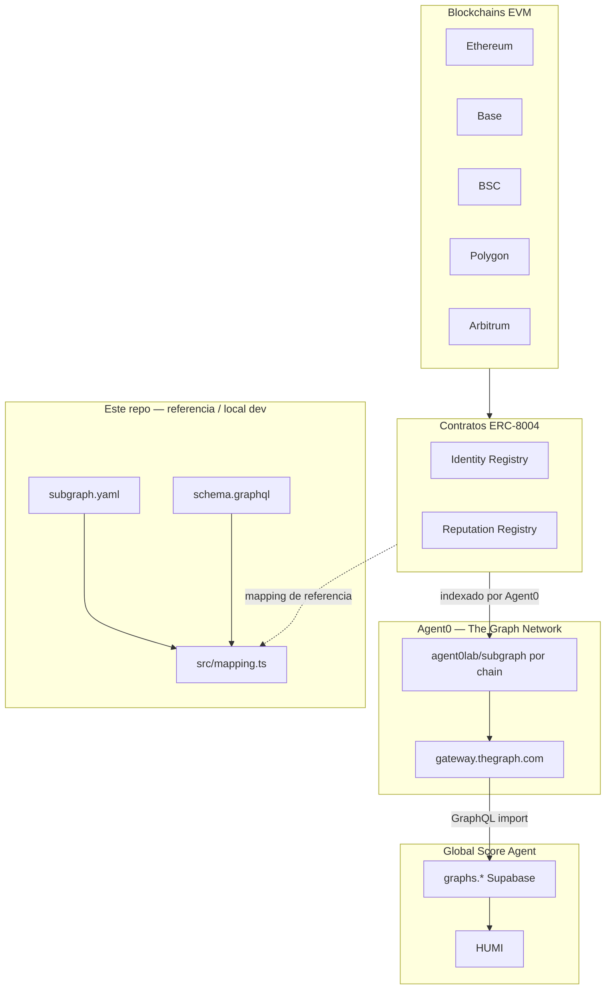

# Arquitectura — Subgraph ERC-8004

> **Documento maestro de grafos GSA:** ver [`arquitectura-grafos-gsa.md`](arquitectura-grafos-gsa.md) (Agent0, Goldsky, catálogo de productos, pipeline Supabase). Este archivo detalla el **código ERC-8004** en la raíz del repo.

## Diagrama de flujo (producción)

**Producción:** GSA importa Agent0 vía `graphs.*`; **no** despliega el subgraph de este repo para HUMI. Ormi fue retirado (jul 2026).

## Componentes del repositorio

| Componente | Tecnología | Rol |
|------------|------------|-----|
| `subgraph.yaml` | The Graph manifest | Define red, contratos, eventos, startBlock (local / referencia) |
| `schema.graphql` | GraphQL | Schema de entidades consultables |
| `src/mapping.ts` | AssemblyScript | Transforma eventos → entidades |
| `abis/agentregistry.json` | JSON ABI | Identity + Reputation comparten ABI |
| `networks.json` | JSON | Metadatos por chain (startBlock, estado; prod = Agent0 en BD) |

## Data sources

### AgentRegistry (Identity)

- Evento: `Registered(uint256 indexed agentId, string agentURI, address indexed owner)`
- Handler: `handleRegistered`
- Decodifica `agentURI` (base64 JSON) y extrae metadatos del agente

### AgentReputation (Reputation)

- Eventos: `NewFeedback`, `ResponseAppended`, `FeedbackRevoked`
- Handlers correspondientes en `mapping.ts`
- `NewFeedback` requiere `receipt: true` para capturar `gasUsed`

## Entidades

### Agent

ID: `{network}-{agentId}`

Campos principales: owner, metadatos (name, description, imageUrl), servicios (mcp, a2a, wallet), flags de indexación, timestamps.

### Feedback

ID: `{network}-{agentId}-{clientAddress}-{feedbackIndex}`

Incluye value, tags, URI, datos de transacción (txFrom, txNonce, gasPrice, gasUsed), flag isRevoked.

### FeedbackResponse

ID: `{network}-{txHash}-{logIndex}`

Vinculado al feedback padre por ID compuesto.

## Modelo multichain

**No** hay un subgraph multichain único. Agent0 despliega **un subgraph por chain** en The Graph Network. El código de este repo replica la misma lógica para desarrollo local.

- **ERC-8004** (raíz): un `subgraph.yaml` que se edita (`network`, `startBlock`) para pruebas locales.
- **Olas Mech Marketplace** ([`subgraphs/olas-marketplace/`](../subgraphs/olas-marketplace/)): import prod vía **Autonolas** oficial; código repo = referencia.
- **Virtual Marketplace** ([`subgraphs/virtual-marketplace/`](../subgraphs/virtual-marketplace/)): manifest Base; deploy **Goldsky** `virtual-acp-base/prod`.
- **ERC-8183 Agentic Commerce** ([`subgraphs/erc-8183-commerce/`](../subgraphs/erc-8183-commerce/)): manifests Base/BSC; deploy **Goldsky**.
- **Ethos Network** ([`subgraphs/ethos-network/`](../subgraphs/ethos-network/)): deploy **Goldsky** `ethos-network-base/prod`.

## Hosting (jul 2026)

| Uso | Proveedor |
|-----|-----------|
| ERC-8004 import HUMI | **Agent0** — `gateway.thegraph.com` |
| Olas Base / Gnosis | **Autonolas** — `api.subgraph.autonolas.tech` |
| Subgraphs propios del repo | **Goldsky** |
| Desarrollo local | Docker Compose (`graph-node`) |
| Ormi 0xGraph | **Retirado** |

Mapeo Agent0 → Supabase: [`agent0-gsa-field-mapping.md`](agent0-gsa-field-mapping.md).

## Historial tecnológico

Este repo reemplazó un stub **Envio HyperIndex** obsoleto. De marzo a jun 2026 el subgraph ERC-8004 propio se desplegó en **Ormi**; desde jul 2026 el import prod migró por completo a **Agent0**.
