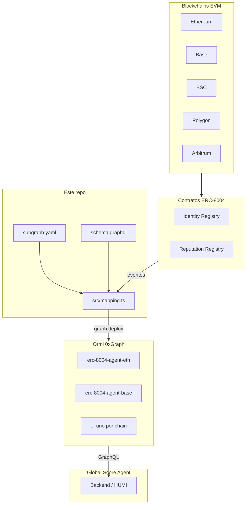

# Arquitectura — Subgraph ERC-8004

## Diagrama de flujo

## Componentes del repositorio

| Componente | Tecnología | Rol |
|------------|------------|-----|
| `subgraph.yaml` | The Graph manifest | Define red, contratos, eventos, startBlock |
| `schema.graphql` | GraphQL | Schema de entidades consultables |
| `src/mapping.ts` | AssemblyScript | Transforma eventos → entidades |
| `abis/agentregistry.json` | JSON ABI | Identity + Reputation comparten ABI |
| `networks.json` | JSON | Metadatos por chain (startBlock, nombre Ormi, estado) |

## Data sources

### AgentRegistry (Identity)

- Evento: `Registered(uint256 indexed agentId, string agentURI, address indexed owner)`
- Handler: `handleRegistered`
- Decodifica `agentURI` (base64 JSON) y extrae metadatos del agente

### AgentReputation (Reputation)

- Eventos: `NewFeedback`, `ResponseAppended`, `FeedbackRevoked`
- Handlers correspondientes en `mapping.ts`
- `NewFeedback` requiere `receipt: true` para capturar `gasUsed`

## Entidades

### Agent

ID: `{network}-{agentId}`

Campos principales: owner, metadatos (name, description, imageUrl), servicios (mcp, a2a, wallet), flags de indexación, timestamps.

### Feedback

ID: `{network}-{agentId}-{clientAddress}-{feedbackIndex}`

Incluye value, tags, URI, datos de transacción (txFrom, txNonce, gasPrice, gasUsed), flag isRevoked.

### FeedbackResponse

ID: `{network}-{txHash}-{logIndex}`

Vinculado al feedback padre por ID compuesto.

## Modelo multichain

**No** hay un subgraph multichain único. El mismo código se despliega N veces cambiando `network` en `subgraph.yaml`. Cada deploy genera un endpoint GraphQL independiente en Ormi.

## Hosting

- **Ormi 0xGraph** — compatible con Graph CLI
- Deploy: `graph deploy` → `https://subgraph.api.ormilabs.com/deploy`
- Subgraphs privados con autenticación por API key en queries

## Historial tecnológico

Este repo reemplazó un stub **Envio HyperIndex** obsoleto en GitHub. La fuente de producción real proviene del subgraph The Graph mantenido localmente y desplegado manualmente a Ormi desde marzo 2026.
