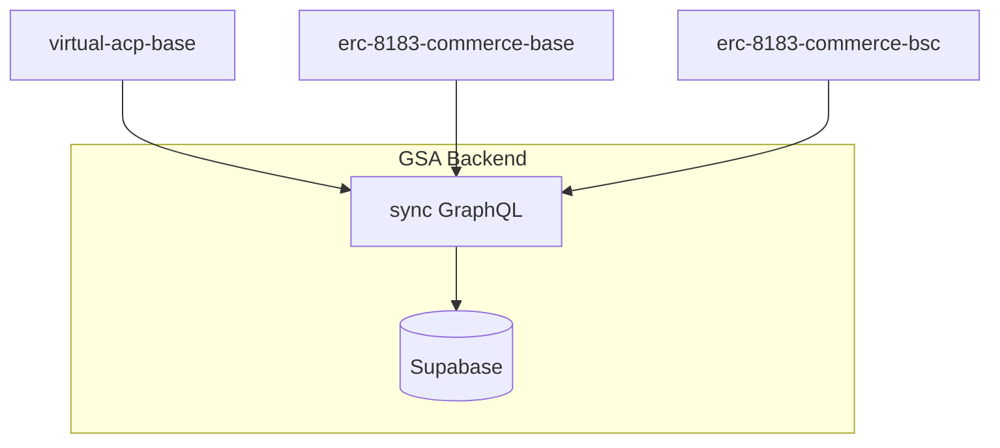
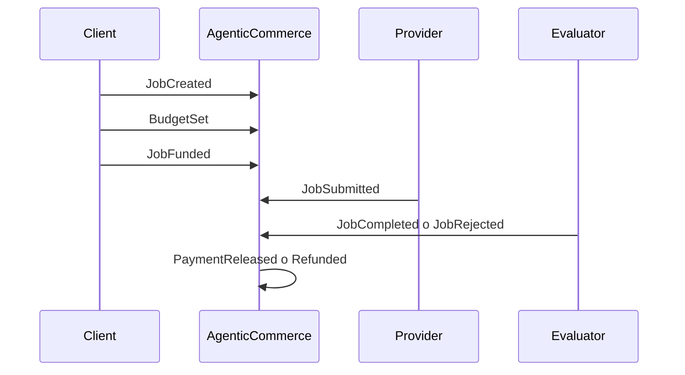

# ERC-8183 Agentic Commerce — Especificación técnica del indexador

**Versión:** 1.0  
**Fecha:** 22 de junio de 2026  
**Chains MVP:** Base, BSC  
**Input de negocio:** `ERC-8183.md` (HUMI Index)

Este documento es la **fuente de verdad técnica** para el cuarto producto de indexing del repo: comercio entre agentes según el estándar **ERC-8183**. Las métricas HUMI (volumen, success rate, etc.) se calculan en **Supabase**, no en el subgraph.

---

## 1. Arquitectura

### 1.1 Un repositorio, cuatro productos de indexing

| Producto | Ubicación | Deploy Ormi |
|----------|-----------|-------------|
| ERC-8004 | Raíz | `erc-8004-agent-*` |
| Olas Mech Marketplace | `subgraphs/olas-marketplace/` | `olas-mech-base`, `olas-mech-gnosis` |
| Virtual Marketplace | `subgraphs/virtual-marketplace/` | `virtual-acp-base` |
| **ERC-8183 Commerce** | `subgraphs/erc-8183-commerce/` | `erc-8183-commerce-base`, `erc-8183-commerce-bsc` |



### 1.2 Fuentes de commerce por implementación

| Implementación | Chain | Subgraph |
|----------------|-------|----------|
| Virtual ACP Core (`AgenticCommerceV3`) | Base | `virtual-acp-base` |
| UFX `AgenticCommerceHooked` | Base | `erc-8183-commerce-base` |
| BNB Agent SDK APEX | BSC | `erc-8183-commerce-bsc` |

GSA une datos por `(chainId, contractAddress, jobId)`.

**Decisión:** Virtual ACP **no** se duplica en `erc-8183-commerce-base` para evitar doble indexación.

### 1.3 Principio de ingesta

- Entidades **inmutables por evento** (patrón Virtual/Olas).
- Campo `contractAddress` en todas las entidades para soportar múltiples kernels por chain.
- **No** indexar EvaluatorRouter ni OptimisticPolicy en MVP: el kernel emite `JobCompleted` / `JobRejected` con el resultado final del comercio.

---

## 2. Contratos validados

Metadatos operativos: [`networks-8183.json`](../networks-8183.json).

### 2.1 Base — UFX AgenticCommerceHooked

| Campo | Valor |
|-------|-------|
| Dirección | `0x1b32B85c914ea30E81F08550c1EBFC5b9d32a855` |
| `implementation` (label) | `ufx_agentic_commerce_hooked` |
| **startBlock** | **46471674** |
| ABI | [`abis/erc8183/AgenticCommerceHooked.abi.json`](../abis/erc8183/AgenticCommerceHooked.abi.json) |

`JobCreated` UFX difiere del estándar Virtual: solo `jobId` y `client` indexed; incluye `string description` en data.

### 2.2 BSC — BNB AgenticCommerce (APEX)

| Campo | Valor |
|-------|-------|
| Proxy (indexar) | `0xea4daa3100a767e86fded867729ae7446476eba6` |
| Implementación | `0x2788d06576Ef83fDBEb00fB848E9fD896fc259E6` |
| `implementation` (label) | `bnb_agentic_commerce_apex` |
| **startBlock** | **102000000** |
| ABI | Misma que V3 (eventos ERC-8183 estándar) |

Contratos auxiliares BNB (no indexados en MVP): EvaluatorRouter `0x51895229…`, OptimisticPolicy `0x9c018457…`.

### 2.3 Excluidos / correcciones del doc de negocio

| Dirección | Motivo |
|-----------|--------|
| `0x119299F33f918808edD5ef92bd79cefB8700C091` | Evaluador, **no** kernel AgenticCommerce |
| `0x16213AB6a660A24f36d4F8DdACA7a3d0856A8AF5` | Reference ACPCore, 0 tx en Base |
| `0x238E541BfefD82238730D00a2208E5497F1832E0` | Virtual ACP → `virtual-acp-base` |

---

## 3. Catálogo de eventos

### 3.1 Matriz ERC-8183 → entidades

| Evento Solidity | Entidad subgraph | Prioridad |
|-----------------|------------------|-----------|
| `JobCreated` | `Erc8183Job` | Alta |
| `JobFunded` | `Erc8183Payment` (`eventType: funded`) | Alta |
| `BudgetSet` | `Erc8183Budget` | Media |
| `JobSubmitted` | `Erc8183Delivery` | Alta |
| `JobCompleted` | `Erc8183JobStatus` (`completed`) | Alta |
| `JobRejected` | `Erc8183JobStatus` (`rejected`) | Media |
| `JobExpired` | `Erc8183JobStatus` (`expired`) | Baja |
| `PaymentReleased` | `Erc8183Payment` (`payment_released`) | Alta |
| `Refunded` | `Erc8183Payment` (`refunded`) | Media |

### 3.2 Firmas Graph (`subgraph.*.yaml`)

**Base (UFX Hooked)** — `JobCreated` no coincide con Virtual/BNB: solo `jobId` y `client` indexed; incluye `string description`:

| Evento | Firma Base |
|--------|------------|
| JobCreated | `JobCreated(indexed uint256,indexed address,address,address,uint256,string,address)` |

**BSC (BNB APEX)** — firma estándar (misma que Virtual ACP):

| Evento | Firma BSC / estándar |
|--------|----------------------|
| JobCreated | `JobCreated(indexed uint256,indexed address,indexed address,address,uint256,address)` |

Eventos comunes (ambas chains):
| JobFunded | `JobFunded(indexed uint256,indexed address,uint256)` |
| BudgetSet | `BudgetSet(indexed uint256,uint256)` |
| JobSubmitted | `JobSubmitted(indexed uint256,indexed address,bytes32)` |
| JobCompleted | `JobCompleted(indexed uint256,indexed address,bytes32)` |
| JobRejected | `JobRejected(indexed uint256,indexed address,bytes32)` |
| JobExpired | `JobExpired(indexed uint256)` |
| PaymentReleased | `PaymentReleased(indexed uint256,indexed address,uint256)` |
| Refunded | `Refunded(indexed uint256,indexed address,uint256)` |

### 3.3 IDs de entidad

- Job: `{network}-{contractAddress}-{jobId}`
- Evento: `{network}-{contractAddress}-{txHash}-{logIndex}`

---

## 4. Flujo de vida del job (kernel)



En BSC el evaluador puede ser el EvaluatorRouter (como `job.evaluator`), pero el **evento indexado** sigue siendo el del kernel.

---

## 5. Schema GraphQL

Entidades en [`subgraphs/erc-8183-commerce/schema.graphql`](../subgraphs/erc-8183-commerce/schema.graphql):

- `Erc8183Job` — creación (`client`, `provider`, `evaluator`, `hook`, `expiredAt`, `implementation`)
- `Erc8183Payment` — fondos, liberación, reembolso
- `Erc8183Budget` — presupuesto acordado
- `Erc8183Delivery` — entrega (`deliverable` bytes32)
- `Erc8183JobStatus` — cierre (`completed` / `rejected` / `expired`, `reason` para enlace ERC-8004)

---

## 6. Operaciones

### 6.1 Scripts npm

| Script | Acción |
|--------|--------|
| `npm run codegen:8183-base` / `8183-bsc` | Generar types |
| `npm run build:8183-base` / `8183-bsc` | Compilar WASM |
| `npm run deploy:8183-base` / `8183-bsc` | Deploy Ormi v1.0.0 |

### 6.2 Endpoints GraphQL (live)

| Chain | Subgraph | Endpoint |
|-------|----------|----------|
| Base | `erc-8183-commerce-base` | `https://subgraph.api.ormilabs.com/api/public/f46db6cd-eefe-4019-b10d-f48b2f2a9ee6/subgraphs/erc-8183-commerce-base/v1.0.0/gn` |
| BSC | `erc-8183-commerce-bsc` | `https://subgraph.api.ormilabs.com/api/public/f46db6cd-eefe-4019-b10d-f48b2f2a9ee6/subgraphs/erc-8183-commerce-bsc/v1.0.0/gn` |

### 6.3 Queries de verificación

```graphql
{
  _meta { block { number } hasIndexingErrors }
  erc8183Jobs(first: 5, orderBy: blockTimestamp, orderDirection: desc) {
    id jobId contractAddress implementation client provider
  }
  erc8183JobStatuses(first: 5, where: { statusType: "completed" }) {
    jobId reason statusType
  }
  erc8183Payments(first: 5, where: { eventType: "funded" }) {
    jobId amount account
  }
}
```

Filtro UFX Base: `contractAddress: "0x1b32b85c914ea30e81f08550c1ebfc5b9d32a855"`.

---

## 7. Alcance MVP vs futuro

| En MVP | Fuera de MVP |
|--------|--------------|
| Kernel AgenticCommerce (9 eventos) | Router/policy BNB (disputas) |
| Base UFX + BSC BNB | Hooks UFX como contratos separados |
| Entidades inmutables | `CommerceJob` mutable agregado |
| | Ethereum, Polygon, Arbitrum (sin volumen) |

---

## 8. Sync esperado

- **Base:** volumen bajo (pocos jobs UFX); sync rápido tras `startBlock` 46471674.
- **BSC:** alto volumen (~200k+ tx en proxy); sync inicial puede tardar horas desde bloque 102000000. Monitorizar `_meta.block.number` en Ormi dashboard.
