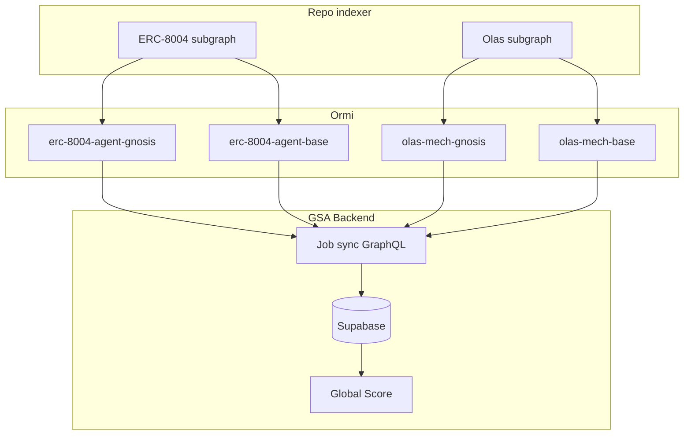
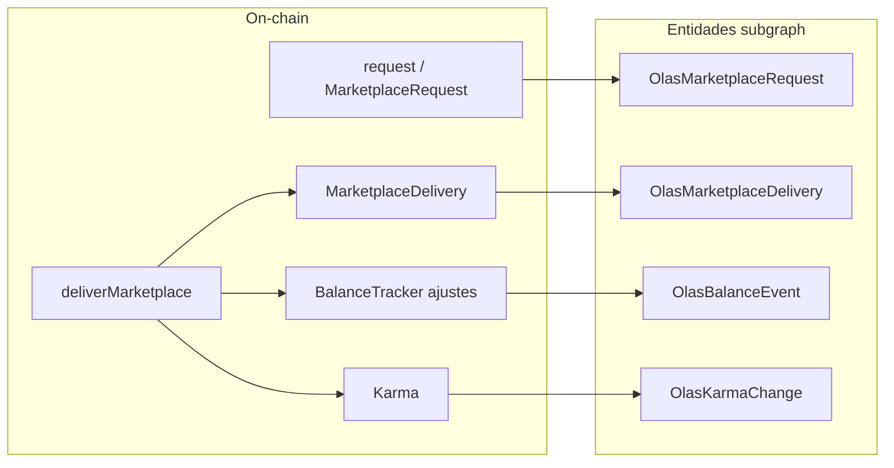
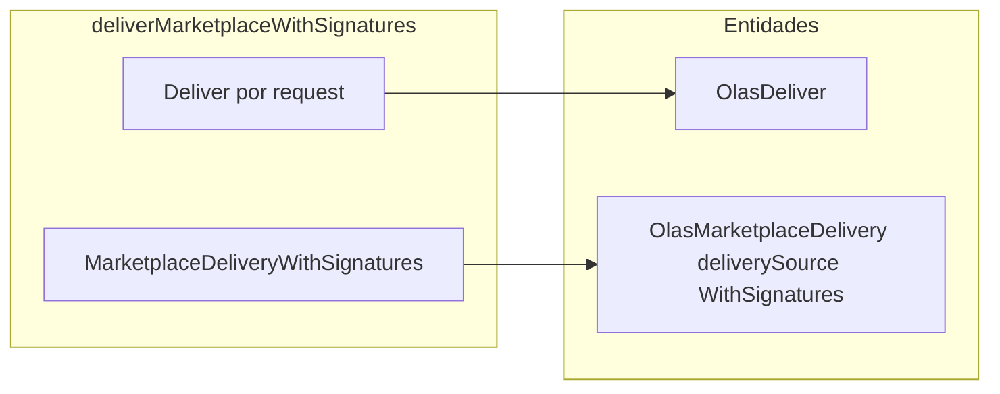
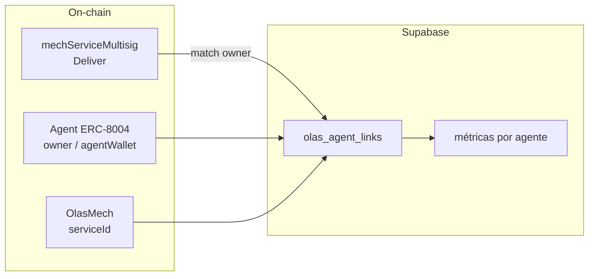
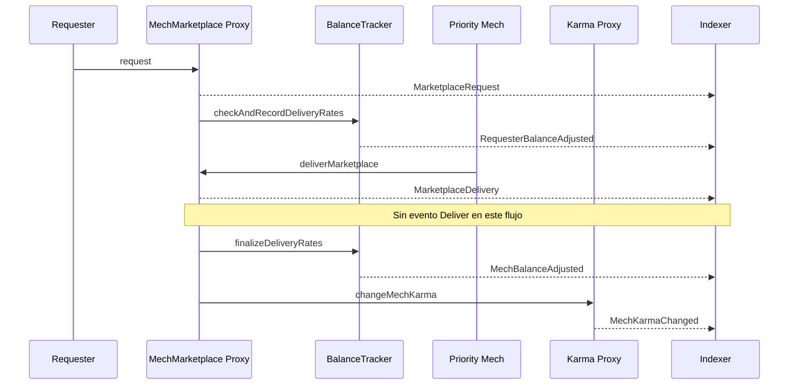

# Olas Mech Marketplace — Especificación técnica del indexador

> **Import prod (jul 2026):** GSA consume el subgraph **oficial Autonolas**, no un deploy propio:
> - Base: `https://api.subgraph.autonolas.tech/api/proxy/marketplace-base`
> - Gnosis: `https://api.subgraph.autonolas.tech/api/proxy/marketplace-gnosis`
>
> El código en `subgraphs/olas-marketplace/` documenta entidades, ABIs y queries para el import Supabase. Un deploy Ormi histórico (`olas-mech-*`) fue **retirado**.

**Versión:** 1.0 (análisis)  
**Fecha:** 22 de junio de 2026  
**Chains MVP:** Gnosis, Base  
**Input de negocio:** `Olas Marketplace.md` (usuario)

Este documento es la **fuente de verdad técnica** para desarrollar el subgraph Olas dentro del repo [`indexer`](../). Las métricas de scoring (Usage, Measures) se calculan en **Supabase**, no en el subgraph.

---

## 1. Arquitectura

### 1.1 Un repositorio, dos productos de indexing

| Producto | Ubicación en repo | Deploy Ormi (ej. Gnosis) |
|----------|-------------------|--------------------------|
| ERC-8004 | Raíz: `subgraph.yaml`, `schema.graphql`, `src/mapping.ts` | `erc-8004-agent-gnosis` |
| Olas Marketplace | `subgraphs/olas-marketplace/` | `olas-mech-gnosis` |

**No se recomienda** un repositorio separado: comparten tooling, convenciones y runbook. El backend GSA consulta **dos endpoints GraphQL por chain** y une datos en PostgreSQL.



### 1.2 Principio de ingesta

- El subgraph almacena **eventos crudos** (y un catálogo mínimo `OlasMech`).
- **No** calcular `success_rate`, `requests_last_30d`, ni Global Score en AssemblyScript.
- PostgreSQL/materialized views agregan por `mech`, ventanas temporales y tipos de pago.

---

## 2. Validación on-chain (Gnosis y Base)

Fuente: [Blockscout Gnosis](https://gnosis.blockscout.com), [Blockscout Base](https://base.blockscout.com). Fecha consulta: junio 2026.

### 2.1 MechMarketplaceProxy v1 (indexar en MVP)

| Chain | Proxy | Deploy block | Deploy date | Tx count (aprox.) |
|-------|-------|--------------|-------------|-------------------|
| Gnosis | `0x735FAAb1c4Ec41128c367AFb5c3baC73509f70bB` | **38661963** | 2025-02-20 | ~61 758 |
| Base | `0xf24eE42edA0fc9b33B7D41B06Ee8ccD2Ef7C5020` | **26642705** | 2025-02-20 | ~7 410 |

Implementación detrás del proxy (Gnosis): `0xE035dcD99F7A8cE0b1d72C3141f100C5B0E9e3bd`.  
Implementación detrás del proxy (Base): `0x155547857680A6D51bebC5603397488988DEb1c8`.

**`startBlock` recomendado:** bloque de creación del proxy v1 en cada chain (ver [`networks-olas.json`](../networks-olas.json)).

### 2.2 Legacy v0 — decisión MVP

| Chain | Dirección legacy | Actividad | Decisión MVP |
|-------|------------------|-----------|--------------|
| Gnosis | `0x4554fE75c1f5576c1d7F765B2A036c199Adae329` (MechMarketplace v0) | **3 txs** | **No indexar** |
| Base | `0x88de734655184a09b70700ae4f72364d1ad23728` | — | **No es marketplace** — es AI Agent Registry v0 |

Toda la actividad relevante del marketplace actual está en el **proxy v1** (feb 2025).

### 2.3 Estimación de volumen y coste Ormi

- Gnosis: alta actividad (~62k txs al contrato proxy; entidades derivadas de logs serán menores pero significativas).
- Base: actividad moderada (~7k txs).
- Entidades esperadas: decenas de miles en Gnosis (requests + deliveries + balance events), dentro de capacidad Ormi para un subgraph adicional por chain.
- Sincronización desde `startBlock` ~feb 2025: ~4 meses de historia en Gnosis/Base al momento del deploy.

---

## 3. Contratos por chain

Direcciones oficiales: [autonolas-marketplace `configuration.json`](https://github.com/valory-xyz/autonolas-marketplace/blob/main/docs/configuration.json).  
Metadatos operativos: [`networks-olas.json`](../networks-olas.json).

### 3.1 Gnosis (chainId 100)

| Rol | Contrato | Dirección |
|-----|----------|-----------|
| Marketplace | MechMarketplaceProxy | `0x735FAAb1c4Ec41128c367AFb5c3baC73509f70bB` |
| Karma | KarmaProxy | `0x2C602C7B590ABFc148d8c7c5e4d58c56Be1d304a` |
| Pagos native | BalanceTrackerFixedPriceNative | `0x21cE6799A22A3Da84B7c44a814a9c79ab1d2A50D` |
| Pagos OLAS | BalanceTrackerFixedPriceToken | `0x53Bd432516707a5212A70216284a99A563aAC1D1` |
| Pagos NVM | BalanceTrackerNvmSubscriptionNative | `0x7D686bD1fD3CFF6E45a40165154D61043af7D67c` |

### 3.2 Base (chainId 8453)

| Rol | Contrato | Dirección |
|-----|----------|-----------|
| Marketplace | MechMarketplaceProxy | `0xf24eE42edA0fc9b33B7D41B06Ee8ccD2Ef7C5020` |
| Karma | KarmaProxy | `0x7F69B6783855772d10A4bc2AFAaE650599F040DB` |
| Pagos native | BalanceTrackerFixedPriceNative | `0xB3921F8D8215603f0Bd521341Ac45eA8f2d274c1` |
| Pagos OLAS | BalanceTrackerFixedPriceToken | `0x43fB32f25dce34EB76c78C7A42C8F40F84BCD237` |
| Pagos USDC | BalanceTrackerFixedPriceToken | `0x0443C55e151dBA13fae079518F9dd01ff9c21CB2` |
| Pagos NVM native | BalanceTrackerNvmSubscriptionNative | `0x3d79737f05966c5925a04d1b04110006F5a072bE` |
| Pagos NVM USDC | BalanceTrackerNvmSubscriptionToken | `0xaaFBeef195BDAb1Bb6f3Dc9cEbA875Cd72499230` |

**Regla:** indexar siempre la dirección del **proxy** (eventos emitidos desde el proxy).

---

## 4. Catálogo de eventos

### 4.1 Documento base vs realidad

| Doc. negocio | Evento real | Contrato |
|--------------|-------------|----------|
| `RequestCreated` | **`MarketplaceRequest`** | MechMarketplace |
| `Delivery` + success | **`MarketplaceDelivery`** (`deliveredRequests[]`) | MechMarketplace |
| `MechRegistered` | **`CreateMech`** | MechMarketplace |
| Pagos con `requestId` | **BalanceTracker** (sin `requestId` en evento) | BalanceTracker* |
| `KarmaUpdated` | **`MechKarmaChanged`**, **`RequesterMechKarmaChanged`** | Karma |

### 4.2 MechMarketplace — eventos MVP

| Evento | Firma para `subgraph.yaml` | Handler |
|--------|---------------------------|---------|
| CreateMech | `CreateMech(indexed address,indexed uint256,indexed address)` | `handleCreateMech` |
| MarketplaceRequest | `MarketplaceRequest(indexed address,indexed address,uint256,bytes32[],bytes[])` | `handleMarketplaceRequest` |
| MarketplaceDelivery | `MarketplaceDelivery(indexed address,address[],uint256,bytes32[],bool[])` | `handleMarketplaceDelivery` |
| MarketplaceDeliveryWithSignatures | `MarketplaceDeliveryWithSignatures(indexed address,indexed address,uint256,bytes32[])` | `handleMarketplaceDeliveryWithSignatures` |
| Deliver | `Deliver(indexed address,indexed address,bytes32,uint256,bytes)` | `handleDeliver` |

**Firma desplegada (validada Blockscout, jun 2026):** el proxy v1 emite `Deliver` con un solo campo `bytes data`, no dos (`requestData`/`deliveryData`). Topic0: `0xb0d013658abb05dd269ff3ab257175d5ae3fa4107d4e142abd96e947cd5cb06f`. El ABI en [`abis/olas/MechMarketplace.abi.json`](../abis/olas/MechMarketplace.abi.json) debe coincidir con esta firma para que graph-node indexe los logs.

**Roles en el flujo:**

- `requester` — quien **pide** el servicio (cliente).
- `priorityMech` / `deliveryMech` — quien **recibe/ejecuta** (proveedor / agente mech).
- `mechServiceMultisig` (en `Deliver`) — operador del servicio; candidato fuerte para vínculo ERC-8004. Solo disponible en el flujo **WithSignatures** (ver §4.6).

**Handlers de arrays:** en `MarketplaceRequest` y `MarketplaceDelivery`, explotar arrays (`requestIds[]`, `deliveredRequests[]`) creando **una entidad por `requestId`** en el mapping.

### 4.6 Mapeo del flujo habitual vs flujo WithSignatures

Olas tiene **dos caminos** de entrega en `MechMarketplace`. El subgraph indexa ambos, pero el volumen on-chain no es el mismo.

#### Flujo habitual (mayoría del volumen)

El requester crea un pedido; el mech ejecuta y llama `deliverMarketplace`. El marketplace emite **`MarketplaceDelivery`** con arrays `requestIds[]` y `deliveredRequests[]` (bool por request).



| Pregunta de negocio | ¿Cómo saberlo? | Entidad / campo |
|---------------------|----------------|-----------------|
| ¿Hubo un pedido? | Sí | `OlasMarketplaceRequest` (`requestId`, `requester`, `priorityMech`) |
| ¿El agente entregó la tarea? | Sí | `OlasMarketplaceDelivery` → **`delivered`** (bool) |
| ¿Quién entregó? | Sí | `OlasMarketplaceDelivery.deliveryMech` |
| ¿Se cobró / pagó? | Indirecto | `OlasBalanceEvent` (`RequesterBalanceAdjusted`, `MechBalanceAdjusted`) |
| ¿Subió karma del mech? | Sí | `OlasKarmaChange` |

En este flujo **no se emite** `Deliver`. Por eso `olas_deliver` puede estar en **cero en Base** y el marketplace sigue teniendo miles de entregas en `olas_marketplace_delivery`.

#### Flujo WithSignatures (minoritario)

`deliverMarketplaceWithSignatures` emite, **en la misma transacción**:

1. **`Deliver`** (uno por `requestId`) — incluye `mechServiceMultisig` y `data` (hash/ref IPFS de la respuesta)
2. **`MarketplaceDeliveryWithSignatures`** — resumen con `requestIds[]`



| Pregunta | Flujo habitual | Flujo WithSignatures |
|----------|----------------|----------------------|
| ¿Entregó? | `OlasMarketplaceDelivery.delivered` | `OlasMarketplaceDelivery` (mismo tipo; `deliverySource`) |
| Multisig operador | No en subgraph | `OlasDeliver.mechServiceMultisig` |
| Payload respuesta on-chain | Off-chain / IPFS vía request | `OlasDeliver.data` |

**GSA / Global Score:** las métricas de uso y éxito de entrega deben basarse en **`OlasMarketplaceDelivery`** (y requests + pagos). `OlasDeliver` es complementario (vínculo ERC-8004 vía multisig, payload IPFS).

**Corrección jun 2026:** el manifest usaba firma `Deliver(..., bytes, bytes)` (repo GitHub reciente); el despliegue v1 usa `Deliver(..., bytes)`. Eso dejaba `olas_deliver` en 0 en Gnosis aunque existieran logs `Deliver` junto a `MarketplaceDeliveryWithSignatures`. Redeploy con firma corregida en `subgraph.base.yaml` y `subgraph.gnosis.yaml`.

### 4.3 BalanceTracker — eventos MVP

| Evento | Firma | Campos clave |
|--------|-------|--------------|
| Deposit | `Deposit(indexed address,indexed address,uint256)` | account, token, amount |
| RequesterBalanceAdjusted | `RequesterBalanceAdjusted(indexed address,uint256,uint256)` | requester, deliveryRate, balance |
| MechBalanceAdjusted | `MechBalanceAdjusted(indexed address,uint256,uint256,uint256)` | mech, deliveryRate, balance, rateDiff |
| Withdraw | `Withdraw(indexed address,indexed address,uint256)` | account, token, amount |
| Drained | `Drained(indexed address,uint256)` | token, collectedFees |

NVM adicional: `RequesterCreditsRedeemed(indexed address,uint256,uint256)`.

Cada instancia de BalanceTracker = **dataSource** separado con `paymentType` en el handler (`native`, `olas`, `usdc`, `nvm`).

### 4.4 Karma — eventos MVP

| Evento | Firma | Notas |
|--------|-------|-------|
| MechKarmaChanged | `MechKarmaChanged(indexed address,int256)` | Delta de karma del mech |
| RequesterMechKarmaChanged | `RequesterMechKarmaChanged(indexed address,indexed address,int256)` | Karma relación requester↔mech |

Karma es el **score de reputación del protocolo Olas** (distinto del Global Score GSA). Los eventos registran **cambios** (`karmaChange`); el acumulado se reconstruye en Supabase o se lee on-chain (`mapMechKarma`).

### 4.5 ABIs en el repo

Artefactos Hardhat descargados en [`abis/olas/`](../abis/olas/). Para Graph CLI se extrajeron arrays planos `*.abi.json`.

---

## 5. Schema GraphQL

Definido en [`subgraphs/olas-marketplace/schema.graphql`](../subgraphs/olas-marketplace/schema.graphql).

| Entidad | ID | Propósito |
|---------|-----|-----------|
| `OlasMech` | `{network}-{mech}` | Catálogo de mechs; `serviceId`, `mechFactory`, actividad |
| `OlasMarketplaceRequest` | `{network}-{requestId}` | Request por id; requester + priorityMech |
| `OlasMarketplaceDelivery` | `{network}-{requestId}-{deliveryMech}-{logIndex}` | Entrega + flag `delivered` |
| `OlasDeliver` | `{network}-{txHash}-{logIndex}` | Respuesta on-chain (IPFS en `data`) |
| `OlasBalanceEvent` | `{network}-{txHash}-{logIndex}` | Evento de pago crudo |
| `OlasKarmaChange` | `{network}-{txHash}-{logIndex}` | Cambio de karma |

Campos comunes en entidades inmutables: `chainId`, `blockNumber`, `blockTimestamp`, `txHash`, `logIndex`.

---

## 6. Borrador tablas Supabase

Sincronizar desde GraphQL Ormi (poll incremental por `blockNumber` / `id`).

```sql
-- Catálogo de mechs Olas
CREATE TABLE olas_mechs (
  id TEXT PRIMARY KEY,
  chain_id TEXT NOT NULL,
  mech TEXT NOT NULL,
  service_id NUMERIC NOT NULL,
  mech_factory TEXT,
  first_seen_at TIMESTAMPTZ,
  last_activity_at TIMESTAMPTZ,
  synced_at TIMESTAMPTZ DEFAULT now()
);

-- Requests (quien pide → priorityMech)
CREATE TABLE olas_requests (
  id TEXT PRIMARY KEY,
  chain_id TEXT NOT NULL,
  request_id TEXT NOT NULL,
  priority_mech TEXT NOT NULL,
  requester TEXT NOT NULL,
  block_number BIGINT NOT NULL,
  block_timestamp TIMESTAMPTZ NOT NULL,
  tx_hash TEXT NOT NULL
);

-- Deliveries (quien ejecuta + éxito)
CREATE TABLE olas_deliveries (
  id TEXT PRIMARY KEY,
  chain_id TEXT NOT NULL,
  request_id TEXT NOT NULL,
  delivery_mech TEXT NOT NULL,
  requester TEXT NOT NULL,
  delivered BOOLEAN NOT NULL,
  delivery_source TEXT,
  block_timestamp TIMESTAMPTZ NOT NULL
);

-- Respuestas Deliver (IPFS)
CREATE TABLE olas_delivers (
  id TEXT PRIMARY KEY,
  chain_id TEXT NOT NULL,
  request_id TEXT NOT NULL,
  mech TEXT NOT NULL,
  mech_service_multisig TEXT,
  delivery_rate NUMERIC,
  data_hex TEXT,
  block_timestamp TIMESTAMPTZ NOT NULL
);

-- Pagos
CREATE TABLE olas_balance_events (
  id TEXT PRIMARY KEY,
  chain_id TEXT NOT NULL,
  event_type TEXT NOT NULL,
  payment_type TEXT NOT NULL,
  balance_tracker TEXT NOT NULL,
  account TEXT,
  mech TEXT,
  requester TEXT,
  amount NUMERIC,
  delivery_rate NUMERIC,
  balance NUMERIC,
  block_timestamp TIMESTAMPTZ NOT NULL
);

-- Karma Olas
CREATE TABLE olas_karma_changes (
  id TEXT PRIMARY KEY,
  chain_id TEXT NOT NULL,
  change_type TEXT NOT NULL,
  mech TEXT NOT NULL,
  requester TEXT,
  karma_change NUMERIC NOT NULL,
  block_timestamp TIMESTAMPTZ NOT NULL
);

-- Vínculo Mech Olas ↔ Agente ERC-8004 (backend)
CREATE TABLE olas_agent_links (
  id UUID PRIMARY KEY DEFAULT gen_random_uuid(),
  chain_id TEXT NOT NULL,
  mech TEXT NOT NULL,
  erc8004_agent_id TEXT,
  link_source TEXT NOT NULL,
  confidence NUMERIC,
  created_at TIMESTAMPTZ DEFAULT now(),
  UNIQUE (chain_id, mech, erc8004_agent_id, link_source)
);
```

### 6.1 Métricas derivadas (ejemplos SQL / materialized views)

Calcular en Supabase, no en subgraph:

- `requests_received` — COUNT requests WHERE `priority_mech = :mech`
- `requests_as_client` — COUNT requests WHERE `requester = :address`
- `deliveries_completed` — COUNT deliveries WHERE `delivery_mech = :mech AND delivered = true`
- `success_rate` — ratio deliveries completed / requests recibidos
- `total_volume_native` — SUM `delivery_rate` o `amount` en `olas_balance_events` por `mech` y `payment_type`
- `karma_total` — SUM `karma_change` por `mech` (o lectura on-chain periódica)
- `unique_counterparties` — COUNT DISTINCT requesters/requestees en ventana 30d
- `active_days_last_30` — COUNT DISTINCT date(block_timestamp) con actividad

---

## 7. Vínculo Mech Olas ↔ ERC-8004

No existe campo on-chain directo. El subgraph expone direcciones; el **join ocurre en GSA**.



### 7.1 Reglas de matching (orden de confianza)

| Prioridad | Regla | `link_source` | Confianza |
|-----------|-------|---------------|-----------|
| 1 | `Agent.owner` o `agentWallet` == `mechServiceMultisig` (evento `Deliver`) | `owner_multisig` | Alta |
| 2 | `Agent.owner` == operador del `serviceId` en registro Autonolas | `service_registry` | Media-alta |
| 3 | URL/metadata ERC-8004 (`web`, `mcp`, `a2a`) coincide con off-chain URL del mech | `metadata_url` | Media |
| 4 | Mismo `requester`/`mech` con alta correlación temporal (heurística) | `activity_heuristic` | Baja |
| 5 | Claim manual / curación | `manual` | Variable |

### 7.2 Datos necesarios de cada subgraph

| Subgraph | Campos para linking |
|----------|---------------------|
| ERC-8004 | `Agent.id`, `owner`, `agentWallet`, `web`, `mcp`, `a2a` |
| Olas | `OlasMech.mech`, `serviceId`, `OlasDeliver.mechServiceMultisig`, `priorityMech`, `deliveryMech` |

---

## 8. Estructura del repositorio

```
indexer/
  abis/olas/
    *.json              # artefactos Hardhat (fuente)
    *.abi.json          # ABIs planos para Graph CLI
  networks-olas.json    # direcciones, startBlocks, deploy names
  subgraphs/olas-marketplace/
    subgraph.base.yaml    # Base (7 dataSources) — olas-mech-base
    subgraph.gnosis.yaml  # Gnosis (5 dataSources) — olas-mech-gnosis
    README.md             # guía rápida manifests y scripts npm
    schema.graphql
    src/mapping.ts        # handlers compartidos
  docs/olas-marketplace-indexer.md   # este documento
```

El subgraph ERC-8004 en la raíz **no se modifica** para Olas.

---

## 9. Manifest y deploy

### 9.1 Manifests por chain (live)

| Chain | Archivo | Deploy Ormi | dataSources |
|-------|---------|-------------|-------------|
| Base | [`subgraph.base.yaml`](../subgraphs/olas-marketplace/subgraph.base.yaml) | `olas-mech-base` v1.0.0 | 7 |
| Gnosis | [`subgraph.gnosis.yaml`](../subgraphs/olas-marketplace/subgraph.gnosis.yaml) | `olas-mech-gnosis` v1.0.0 | 5 |

Valores de direcciones y `startBlock` en [`networks-olas.json`](../networks-olas.json). No usar un `subgraph.yaml` genérico — fue reemplazado por manifests por chain.

### 9.2 Deploy Ormi (PowerShell)

```powershell
# Desde la raíz del repo (ORMI_DEPLOY_KEY en .env)
npm run codegen:olas-gnosis
npm run build:olas-gnosis
npm run deploy:olas-gnosis

# Redeploy Base (sin editar código):
npm run deploy:olas-base
```

### 9.3 Verificación post-deploy

```graphql
{ _meta { block { number } hasIndexingErrors } }
{ olasMeches(first: 5) { id mech serviceId chainId } }
{ olasMarketplaceRequests(first: 5, orderBy: blockTimestamp, orderDirection: desc) {
    id requester priorityMech requestId
  }
}
{ olasBalanceEvents(first: 3, where: { paymentType: "olas" }) { eventType amount } }
{ olasKarmaChanges(first: 3) { mech karmaChange changeType } }
```

Endpoints: `graphqlEndpoint` en [`networks-olas.json`](../networks-olas.json). IDs con prefijo `base-` o `gnosis-`. Consultar `olasMeches` (no `olasMechs`).

---

## 10. Flujo request → delivery → pago → karma

Diagrama de secuencia del **flujo habitual** (`deliverMarketplace`). El evento `Deliver` **no** aparece en este camino.



Flujo alternativo **WithSignatures:** `deliverMarketplaceWithSignatures` emite `Deliver` + `MarketplaceDeliveryWithSignatures` en la misma tx. Ver §4.6.

---

## 11. Checklist de implementación

### Fase análisis (este documento)

- [x] Validar direcciones y `startBlock` v1 vs legacy
- [x] Decisión legacy: solo proxy v1 en MVP
- [x] ABIs en `abis/olas/`
- [x] Schema GraphQL y `networks-olas.json`
- [x] Plantilla `subgraph.yaml` Gnosis
- [x] Borrador SQL Supabase
- [x] Estrategia vínculo ERC-8004

### Fase implementación (jun 2026)

- [x] Implementar handlers en `subgraphs/olas-marketplace/src/mapping.ts`
- [x] Explode arrays en `MarketplaceRequest` / `MarketplaceDelivery`
- [x] `graph codegen && graph build` sin errores
- [x] Manifests duales: `subgraph.base.yaml` (7 DS) y `subgraph.gnosis.yaml` (5 DS)
- [x] Deploy `olas-mech-base` v1.0.0 → verificar queries
- [x] Deploy `olas-mech-gnosis` v1.0.0 → verificar queries
- [x] Redeploy Olas: firma `Deliver` corregida (`bytes` único) en Base + Gnosis (jun 2026)
- [x] Verificar `olasDelivers` > 0 en Gnosis tras re-sync (confirmado jun 2026; Base puede seguir en 0 si no hay WithSignatures)
- [ ] Job sync GSA → tablas Supabase
- [ ] Materialized views de métricas Usage/Measures
- [ ] Pipeline `olas_agent_links`

---

## 12. Fuera de alcance MVP

- **Virtual Protocol** — subgraph separado `virtual-acp-base`; ver [`docs/virtual-marketplace-indexer.md`](virtual-marketplace-indexer.md) (análisis Base completado jun 2026).
- **Legacy MechMarketplace v0** en Gnosis (3 txs).
- **Contratos Mech individuales** — eventos directos; el marketplace centraliza request/delivery.
- **Agregaciones de score** en el subgraph.

---

## 13. Referencias

- [autonolas-marketplace](https://github.com/valory-xyz/autonolas-marketplace)
- [configuration.json](https://github.com/valory-xyz/autonolas-marketplace/blob/main/docs/configuration.json)
- [Olas Stack — Mech Marketplace](https://stack.olas.network/mech-server/)
- [Ormi operaciones](operaciones.md)
- [`networks-olas.json`](../networks-olas.json)
