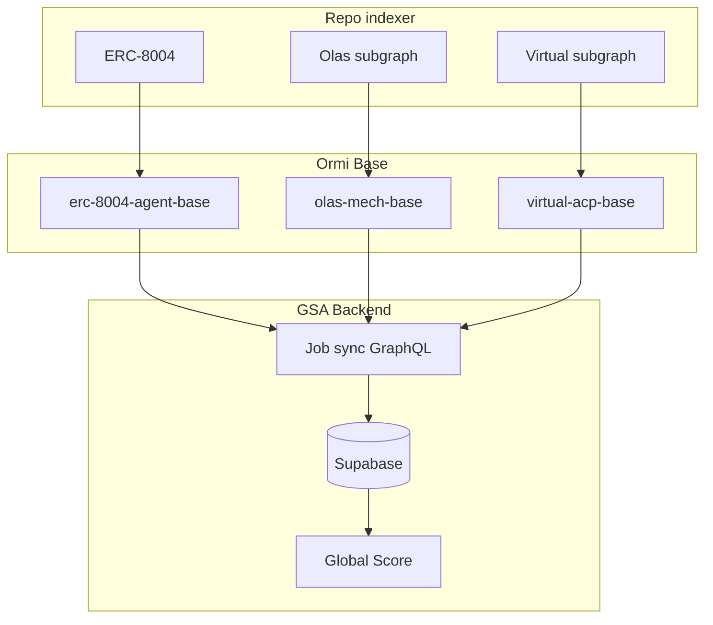
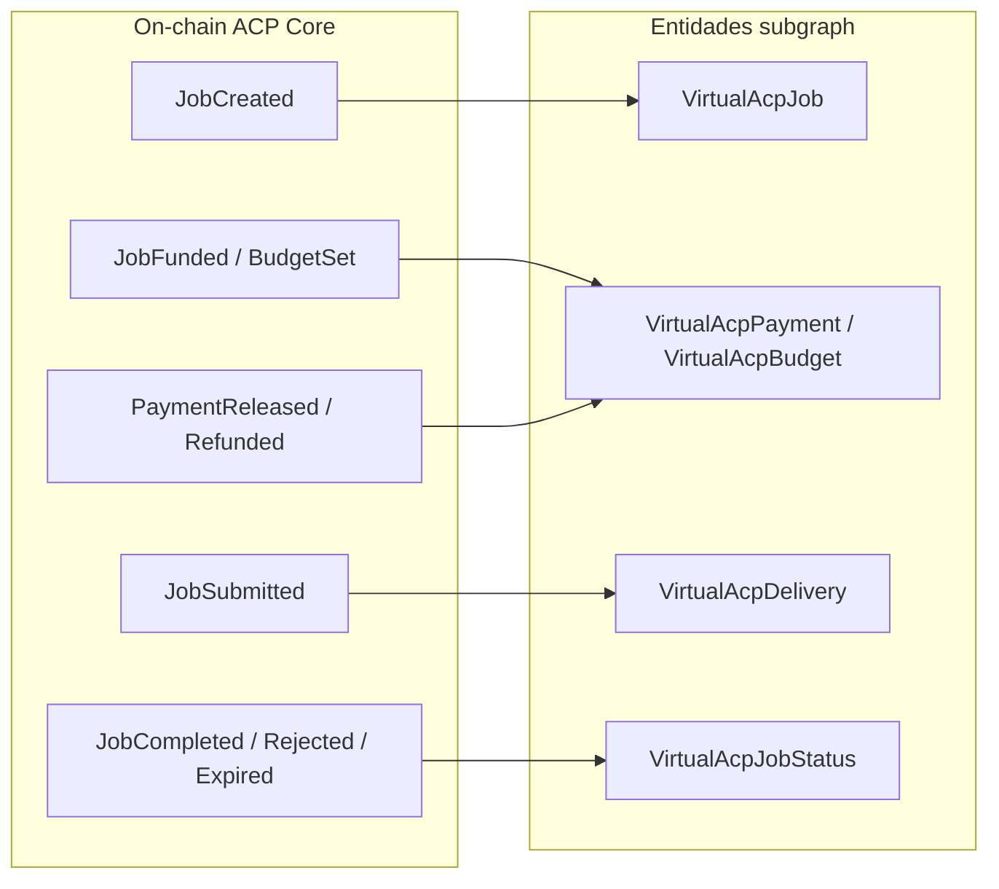
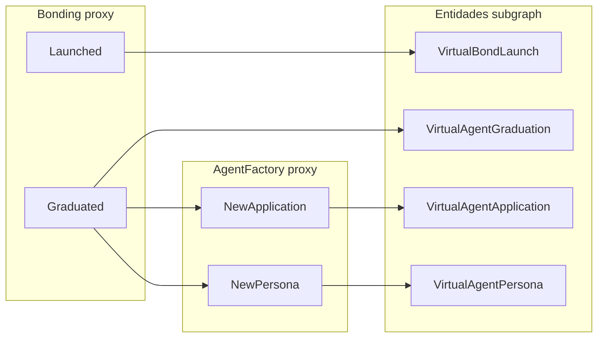
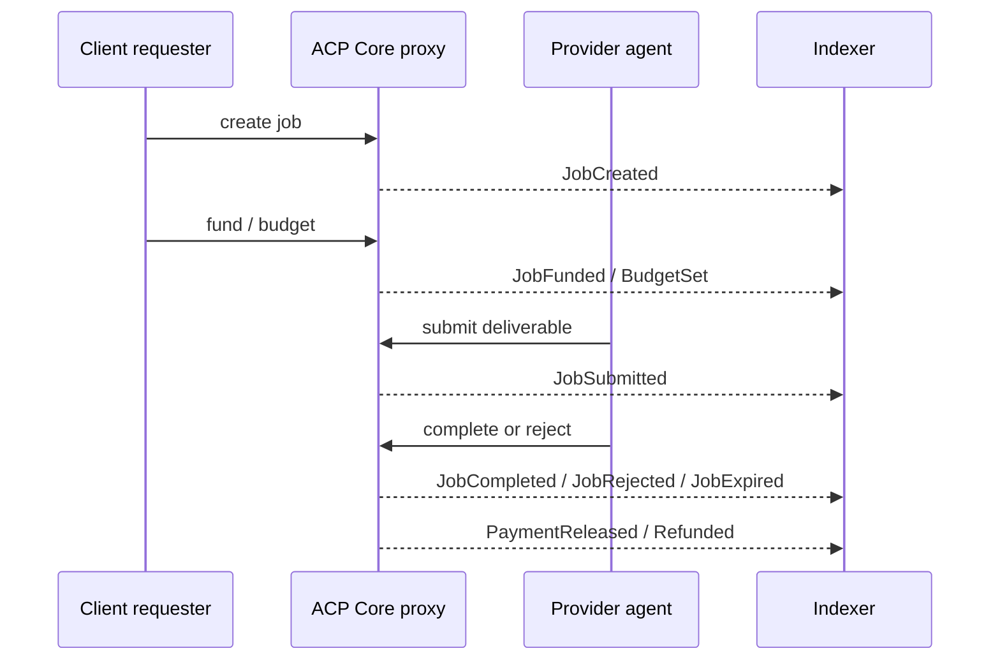

# Virtual Marketplace — Especificación técnica del indexador

**Versión:** 1.0 (análisis)  
**Fecha:** 22 de junio de 2026  
**Chain MVP:** Base  
**Input de negocio:** `Virtual Marketplace.md` (usuario)

Este documento es la **fuente de verdad técnica** para desarrollar el subgraph Virtuals dentro del repo [`indexer`](../). Las métricas de scoring (Usage, History, Bonding) se calculan en **Supabase**, no en el subgraph.

---

## 1. Arquitectura

### 1.1 Un repositorio, tres productos de indexing

| Producto | Ubicación | Deploy Ormi (Base) |
|----------|-----------|-------------------|
| ERC-8004 | Raíz: `subgraph.yaml`, `schema.graphql`, `src/mapping.ts` | `erc-8004-agent-base` |
| Olas Mech Marketplace | `subgraphs/olas-marketplace/` | `olas-mech-base` |
| Virtual Marketplace | `subgraphs/virtual-marketplace/` | `virtual-acp-base` |

El backend GSA consultará **tres endpoints GraphQL por chain** (donde aplique) y unirá datos en PostgreSQL.



### 1.2 Principio de ingesta

- El subgraph almacena **eventos crudos** on-chain.
- **No** calcular `success_rate_acp`, `total_bonded_amount`, ni Global Score en AssemblyScript.
- Bonding Curve y ACP son **dataSources separados** en un mismo manifest Base; la separación semántica se mantiene en Supabase.

### 1.3 Hallazgo crítico: documento de negocio vs on-chain

| Documento de negocio | Realidad validada (Base, jun 2026) |
|----------------------|-------------------------------------|
| `ACPRouter`, `JobManager`, `PaymentManager`… | Despliegue Base usa proxy **ACP Core** → implementación **`AgenticCommerceV3`** (contrato consolidado, no módulos expuestos por separado) |
| Eventos `job.created`, `job.funded`… | Tipos del **SDK v2** (`agent.on("entry")`); en cadena existen como **`JobCreated`**, **`JobFunded`**, etc. en `AgenticCommerceV3` |
| `AgentGraduated` | Evento Solidity **`Graduated(address token, address agentToken)`** en `Bonding` |
| `AgentCreated` | **`NewPersona`** / **`NewApplication`** en `AgentFactoryV3` |
| `Bonded` / Purchase | **`buy()`/`sell()` no emiten eventos** en `Bonding`; usar `Launched` + `Graduated`; compras en curva requieren indexar `FRouter`/`FPair` (fuera de MVP) |

---

## 2. Validación on-chain (Base)

Fuente: [Base Blockscout](https://base.blockscout.com). Fecha consulta: junio 2026.

### 2.1 ACP Core (Agent Commerce Protocol v2)

| Campo | Valor |
|-------|-------|
| Proxy (indexar) | `0x238E541BfefD82238730D00a2208E5497F1832E0` |
| Implementación | `0x8e86FbEf4a4c927561cb6447cEd77ffFbf3B77BC` (`AgenticCommerceV3`) |
| Tipo proxy | ERC-1967 (UUPS) |
| **startBlock** | **44427015** |
| Primera actividad | 2026-04-08 (aprox.) |
| Tx count (proxy) | ~1 888 |
| Token transfers | ~28 825 |

**Decisión legacy ACP v1:** no indexar repos modulares (`ACPRouter` + `JobManager`) salvo que se identifique un despliegue legacy con volumen; el producto actual en Base es `AgenticCommerceV3`.

### 2.2 FundTransferHook

| Campo | Valor |
|-------|-------|
| Dirección (whitepaper) | `0x90717828D78731313CB350D6a58b0f91668Ea702` |
| Verificación Blockscout | **No verificada** (jun 2026) |
| MVP | **Opcional** — `JobCreated` incluye campo `hook`; filtrar jobs con fund transfer en Supabase |

### 2.3 Bonding Curve

| Campo | Valor |
|-------|-------|
| Proxy | `0xF66DeA7b3e897cD44A5a231c61B6B4423d613259` |
| Implementación | `0xC9A91ccACFdc0001e2c41a56a75384598b70B89F` (`Bonding`) |
| **startBlock** | **21841737** |
| Deploy | 2024-11-01 |
| Tx count | **~1 688 705** |

**Impacto sync:** volumen muy superior a ACP; monitorizar tiempo de indexación en Ormi.

### 2.4 AgentFactory

| Campo | Valor |
|-------|-------|
| Proxy | `0x71B8EFC8BCaD65a5D9386D07f2Dff57ab4EAf533` |
| Implementación | `0xfd8c35798eAA6fF8d1902f1B804d3341df09e895` (`AgentFactoryV3`) |
| **startBlock** | **21841409** |
| Tx count (proxy) | ~39 (la factory recibe llamadas desde `Bonding` en `Graduated`) |

Metadatos operativos: [`networks-virtual.json`](../networks-virtual.json).

---

## 3. Contratos por chain (Base)

| Rol | Contrato | Dirección proxy | ABI |
|-----|----------|-----------------|-----|
| ACP (commerce) | ACP Core | `0x238E541BfefD82238730D00a2208E5497F1832E0` | [`AgenticCommerceV3.abi.json`](../abis/virtual/AgenticCommerceV3.abi.json) |
| ACP hook (opcional) | FundTransferHook | `0x90717828D78731313CB350D6a58b0f91668Ea702` | Pendiente verificación |
| Lanzamiento | Bonding | `0xF66DeA7b3e897cD44A5a231c61B6B4423d613259` | [`Bonding.abi.json`](../abis/virtual/Bonding.abi.json) |
| Factory agentes | AgentFactoryV3 | `0x71B8EFC8BCaD65a5D9386D07f2Dff57ab4EAf533` | [`AgentFactoryV3.abi.json`](../abis/virtual/AgentFactoryV3.abi.json) |

**Regla:** indexar siempre la dirección del **proxy**.

Fuentes código: [protocol-contracts](https://github.com/Virtual-Protocol/protocol-contracts), [agent-commerce-protocol](https://github.com/Virtual-Protocol/agent-commerce-protocol), [whitepaper ACP](https://whitepaper.virtuals.io/acp/acp-changelogs).

---

## 4. Catálogo de eventos

### 4.1 Matriz documento de negocio → Solidity

#### ACP (prioridad alta)

| Doc negocio | Evento Solidity | Contrato | Entidad subgraph | Prioridad |
|-------------|-----------------|----------|------------------|-----------|
| `job.created` | `JobCreated` | ACP Core | `VirtualAcpJob` | Alta |
| `job.funded` | `JobFunded` | ACP Core | `VirtualAcpPayment` | Alta |
| `budget.set` (SDK) | `BudgetSet` | ACP Core | `VirtualAcpBudget` | Media |
| `job.submitted` | `JobSubmitted` | ACP Core | `VirtualAcpDelivery` | Alta |
| `job.completed` | `JobCompleted` | ACP Core | `VirtualAcpJobStatus` | Alta |
| `job.rejected` | `JobRejected` | ACP Core | `VirtualAcpJobStatus` | Media |
| `job.expired` | `JobExpired` | ACP Core | `VirtualAcpJobStatus` | Baja |
| Volumen / payout | `PaymentReleased` | ACP Core | `VirtualAcpPayment` | Alta |
| Reembolso | `Refunded` | ACP Core | `VirtualAcpPayment` | Media |

#### Bonding (prioridad media)

| Doc negocio | Evento Solidity | Contrato | Entidad subgraph | Prioridad |
|-------------|-----------------|----------|------------------|-----------|
| Lanzamiento token | `Launched` | Bonding | `VirtualBondLaunch` | Media |
| `AgentGraduated` | `Graduated` | Bonding | `VirtualAgentGraduation` | Media |
| Deploy pool | `Deployed` | Bonding | `VirtualBondDeploy` | Baja |
| `AgentCreated` | `NewPersona` | AgentFactory | `VirtualAgentPersona` | Baja |
| Application BC | `NewApplication` | AgentFactory | `VirtualAgentApplication` | Baja |
| Compra en curva | *(ninguno en Bonding)* | — | — | Diferido |

### 4.2 Firmas para `subgraph.yaml` (AgenticCommerceV3 @ proxy)

| Evento | Firma Graph |
|--------|-------------|
| JobCreated | `JobCreated(indexed uint256,indexed address,indexed address,address,uint256,address)` |
| JobFunded | `JobFunded(indexed uint256,indexed address,uint256)` |
| BudgetSet | `BudgetSet(indexed uint256,uint256)` |
| JobSubmitted | `JobSubmitted(indexed uint256,indexed address,bytes32)` |
| JobCompleted | `JobCompleted(indexed uint256,indexed address,bytes32)` |
| JobRejected | `JobRejected(indexed uint256,indexed address,bytes32)` |
| JobExpired | `JobExpired(indexed uint256)` |
| PaymentReleased | `PaymentReleased(indexed uint256,indexed address,uint256)` |
| Refunded | `Refunded(indexed uint256,indexed address,uint256)` |

Handlers propuestos: `handleJobCreated`, `handleJobFunded`, `handleBudgetSet`, `handleJobSubmitted`, `handleJobCompleted`, `handleJobRejected`, `handleJobExpired`, `handlePaymentReleased`, `handleRefunded`.

**Notas:**
- `deliverable` y `reason` son `bytes32` (hash/ref on-chain); URLs completas pueden estar off-chain.
- `JobCreated` incluye `evaluator`, `expiredAt`, `hook` (útil para fund-transfer jobs).

### 4.3 Firmas Bonding + AgentFactory

| Evento | Firma Graph |
|--------|-------------|
| Launched | `Launched(indexed address,indexed address,uint256)` |
| Graduated | `Graduated(indexed address,address)` |
| Deployed | `Deployed(indexed address,uint256,uint256)` |
| NewApplication | `NewApplication(uint256)` |
| NewPersona | `NewPersona(uint256,address,address,address,address,address)` |

### 4.4 Fuera del subgraph

| Fuente | Motivo |
|--------|--------|
| Mensajes SSE (`entry.kind === "message"`) | Off-chain / transporte SDK |
| `browseAgents()`, Service Registry | API Virtuals, no logs |
| Requisitos JSON de offerings | Off-chain salvo hash en memo |
| Agregaciones (`success_rate_acp`, `jobs_last_30d`) | Supabase |
| Compras `buy()`/`sell()` sin evento | Requiere `FRouter`/`FPair` o traces (fase 2) |

### 4.5 Mapeo del flujo habitual ACP vs Bonding/Factory

Virtual indexa **dos productos on-chain distintos** en el mismo subgraph Base. El volumen actual (jun 2026, política `acp_aligned`) está casi todo en **ACP**; Bonding/Factory pueden aparecer en **cero** en Ormi sin indicar fallo de deploy.

#### Flujo habitual ACP (mayoría del volumen post-abr 2026)

El cliente crea un job; el proveedor (`provider`) ejecuta y el evaluador cierra el ciclo. Los eventos viven en **ACP Core** (`AgenticCommerceV3`).



| Pregunta de negocio | ¿Cómo saberlo? | Entidad / campo |
|---------------------|----------------|-----------------|
| ¿Hubo un job ACP? | Sí | `VirtualAcpJob` (`jobId`, `client`, **`provider`**) |
| ¿El agente entregó? | Sí | `VirtualAcpDelivery` (`JobSubmitted`) |
| ¿El job se completó? | Sí | `VirtualAcpJobStatus` → **`statusType: "completed"`** |
| ¿Quién es el agente/proveedor? | Sí | `VirtualAcpJob.provider` (wallet del servicio) |
| ¿Hubo pago o reembolso? | Sí | `VirtualAcpPayment` (`eventType`: `funded`, `payment_released`, `refunded`) |
| ¿Jobs completados por agente? | Sí (en Supabase) | Cruzar `VirtualAcpJob.provider` + `VirtualAcpJobStatus` (`completed`) |

**GSA / Global Score:** métricas de **Usage** y **History** en ACP deben basarse en `VirtualAcpJob`, `VirtualAcpJobStatus` y `VirtualAcpPayment`. No dependen de entidades Bonding.

#### Flujo Bonding / AgentFactory (track separado)

Lanzamiento en curva y graduación a agent token. `NewPersona` / `NewApplication` en **AgentFactory** suelen emitirse en la misma transacción que `Graduated` en **Bonding**.



| Pregunta | Flujo ACP | Flujo Bonding/Factory |
|----------|-----------|------------------------|
| ¿Uso agent-to-agent? | `VirtualAcpJob` + status | — |
| ¿Agente lanzado en curva? | — | `VirtualBondLaunch` (`Launched`) |
| ¿Graduó a agent token? | — | `VirtualAgentGraduation` (`agentToken`) |
| Vínculo ERC-8004 (TBA, token) | `provider` / `hook` | `VirtualAgentPersona` (`tba`, `token`) |
| Compras en curva (`buy`/`sell`) | — | **No indexado** (sin evento en Bonding) |

#### Entidades Bonding/Factory en cero (esperado con `acp_aligned`)

Con `startBlock: 44427015` en los tres dataSources, el subgraph **no** incluye launches/graduaciones de nov 2024–mar 2026. Verificación Blockscout (jun 2026):

- Último `Launched` / `Graduated` / `NewPersona` observado: bloque **~43.540.089**
- Inicio ACP / `startBlock` subgraph: **44.427.015**
- Eventos Bonding/Factory con bloque ≥ 44.427.015: **0**

Por tanto, en Ormi es **normal** ver `virtual_bond_launch`, `virtual_agent_graduation`, `virtual_agent_persona` y `virtual_agent_application` en **0** mientras no haya nueva actividad de lanzamiento/graduación post-abr 2026. `hasIndexingErrors: false` y miles de filas en entidades ACP confirman que el deploy funciona.

Para recuperar historial Bonding completo haría falta redeploy con `startBlock` **21841737** / **21841409** (sync lento; fuera del alcance acordado).

---

## 5. Schema GraphQL (borrador)

Principio: entidades **inmutables** por evento; IDs `{network}-{...}`.

```graphql
# subgraphs/virtual-marketplace/schema.graphql (borrador)

type VirtualAcpJob @entity(immutable: true) {
  id: ID! # base-{jobId}
  jobId: BigInt!
  client: Bytes!
  provider: Bytes!
  evaluator: Bytes
  expiredAt: BigInt!
  hook: Bytes
  chainId: String!
  blockNumber: BigInt!
  blockTimestamp: BigInt!
  txHash: Bytes!
  logIndex: BigInt!
}

type VirtualAcpJobStatus @entity(immutable: true) {
  id: ID! # base-{jobId}-{statusType}-{txHash}-{logIndex}
  jobId: BigInt!
  statusType: String! # completed | rejected | expired
  actor: Bytes
  reason: Bytes
  chainId: String!
  blockNumber: BigInt!
  blockTimestamp: BigInt!
  txHash: Bytes!
  logIndex: BigInt!
}

type VirtualAcpDelivery @entity(immutable: true) {
  id: ID!
  jobId: BigInt!
  provider: Bytes!
  deliverable: Bytes!
  chainId: String!
  blockNumber: BigInt!
  blockTimestamp: BigInt!
  txHash: Bytes!
  logIndex: BigInt!
}

type VirtualAcpPayment @entity(immutable: true) {
  id: ID!
  eventType: String! # funded | payment_released | refunded
  jobId: BigInt!
  account: Bytes
  amount: BigInt!
  chainId: String!
  blockNumber: BigInt!
  blockTimestamp: BigInt!
  txHash: Bytes!
  logIndex: BigInt!
}

type VirtualAcpBudget @entity(immutable: true) {
  id: ID!
  jobId: BigInt!
  budget: BigInt!
  chainId: String!
  blockNumber: BigInt!
  blockTimestamp: BigInt!
  txHash: Bytes!
  logIndex: BigInt!
}

type VirtualBondLaunch @entity(immutable: true) {
  id: ID!
  token: Bytes!
  pair: Bytes!
  launchIndex: BigInt!
  chainId: String!
  blockNumber: BigInt!
  blockTimestamp: BigInt!
  txHash: Bytes!
  logIndex: BigInt!
}

type VirtualAgentGraduation @entity(immutable: true) {
  id: ID!
  token: Bytes!
  agentToken: Bytes!
  chainId: String!
  blockNumber: BigInt!
  blockTimestamp: BigInt!
  txHash: Bytes!
  logIndex: BigInt!
}

type VirtualAgentPersona @entity(immutable: true) {
  id: ID!
  virtualId: BigInt!
  token: Bytes!
  dao: Bytes!
  tba: Bytes!
  veToken: Bytes!
  lp: Bytes!
  chainId: String!
  blockNumber: BigInt!
  blockTimestamp: BigInt!
  txHash: Bytes!
  logIndex: BigInt!
}

type VirtualAgentApplication @entity(immutable: true) {
  id: ID!
  applicationId: BigInt!
  chainId: String!
  blockNumber: BigInt!
  blockTimestamp: BigInt!
  txHash: Bytes!
  logIndex: BigInt!
}
```

---

## 6. Borrador SQL Supabase

```sql
-- Jobs ACP (ingesta desde VirtualAcpJob + status/delivery/payment)
CREATE TABLE virtual_acp_jobs (
  id TEXT PRIMARY KEY,
  job_id NUMERIC NOT NULL,
  client TEXT NOT NULL,
  provider TEXT NOT NULL,
  evaluator TEXT,
  hook TEXT,
  chain_id TEXT NOT NULL,
  block_timestamp TIMESTAMPTZ NOT NULL
);

CREATE TABLE virtual_acp_job_status (
  id TEXT PRIMARY KEY,
  job_id NUMERIC NOT NULL,
  status_type TEXT NOT NULL,
  actor TEXT,
  reason TEXT,
  block_timestamp TIMESTAMPTZ NOT NULL
);

CREATE TABLE virtual_acp_payments (
  id TEXT PRIMARY KEY,
  job_id NUMERIC NOT NULL,
  event_type TEXT NOT NULL,
  account TEXT,
  amount NUMERIC,
  block_timestamp TIMESTAMPTZ NOT NULL
);

CREATE TABLE virtual_graduations (
  id TEXT PRIMARY KEY,
  meme_token TEXT NOT NULL,
  agent_token TEXT NOT NULL,
  block_timestamp TIMESTAMPTZ NOT NULL
);

CREATE TABLE virtual_agent_links (
  id TEXT PRIMARY KEY,
  erc8004_agent_id TEXT,
  link_type TEXT NOT NULL,
  virtual_address TEXT NOT NULL,
  confidence TEXT NOT NULL,
  created_at TIMESTAMPTZ DEFAULT now()
);

-- Ejemplo métricas (materialized views, no en subgraph)
-- success_rate_acp = jobs_completed / (jobs_completed + jobs_rejected)
-- total_bonded_amount = SUM desde virtual_bond_events (fase 2)
-- unique_clients = COUNT DISTINCT client por provider
```

---

## 7. Vínculo ERC-8004

| Prioridad | Heurística | Campo subgraph |
|-----------|------------|----------------|
| 1 | `provider` o `client` == `Agent.owner` / wallet ERC-8004 | `provider`, `client` |
| 2 | `agentToken` tras `Graduated` | `VirtualAgentGraduation.agentToken` |
| 3 | `tba` / `token` en `NewPersona` | `VirtualAgentPersona` |
| 4 | Claim manual | `virtual_agent_links` |

Virtuals tiene integración ERC-8004 más explícita que Olas; no hay vínculo automático garantizado.

---

## 8. Estructura del repositorio (futuro)

```
indexer/
  abis/virtual/
    AgenticCommerceV3.abi.json
    Bonding.abi.json
    AgentFactoryV3.abi.json
  networks-virtual.json
  subgraphs/virtual-marketplace/
    subgraph.base.yaml       # 3–4 dataSources
    schema.graphql
    src/mapping.ts
    README.md
  docs/virtual-marketplace-indexer.md
```

El subgraph ERC-8004 y Olas **no se modifican** para Virtual.

---

## 9. Manifest y deploy (futuro)

### 9.1 dataSources MVP (Base)

| dataSource | Contrato | startBlock |
|------------|----------|------------|
| ACPCore | `0x238E541BfefD82238730D00a2208E5497F1832E0` | 44427015 |
| Bonding | `0xF66DeA7b3e897cD44A5a231c61B6B4423d613259` | 44427015 (acp_aligned) |
| AgentFactory | `0x71B8EFC8BCaD65a5D9386D07f2Dff57ab4EAf533` | 44427015 (acp_aligned) |

FundTransferHook: añadir cuando ABI esté verificada.

### 9.2 Scripts npm (propuestos)

```json
"codegen:virtual-base": "graph codegen subgraphs/virtual-marketplace/subgraph.base.yaml",
"build:virtual-base": "graph build subgraphs/virtual-marketplace/subgraph.base.yaml",
"deploy:virtual-base": "graph deploy virtual-acp-base subgraphs/virtual-marketplace/subgraph.base.yaml ..."
```

### 9.3 Verificación post-deploy

```graphql
{ _meta { block { number } hasIndexingErrors } }
{ virtualAcpJobs(first: 5) { id jobId client provider chainId } }
{ virtualAcpJobStatuses(first: 5, where: { statusType: "completed" }) { jobId statusType } }
{ virtualAgentGraduations(first: 5) { id token agentToken } }
```

---

## 10. Flujo job ACP → entrega → pago

Diagrama de secuencia del **flujo habitual ACP** (no incluye Bonding).



Flujo **Bonding/Factory** (`Launched` → `Graduated` → `NewPersona`): ver §4.5. Con `acp_aligned`, puede no haber eventos en la ventana indexada.

---

## 11. Separación Bonding vs ACP en scoring

| Componente | Señal | Peso sugerido en GSA |
|------------|-------|----------------------|
| ACP | Uso productivo agent-to-agent | **Alto** (Usage, History) |
| Bonding | Interés especulativo / validación mercado | **Moderado** |

Ambos se indexan en MVP; agregación y pesos solo en Supabase.

---

## 12. Checklist de implementación

### Fase análisis (este documento)

- [x] Validar direcciones proxy e implementaciones en Base
- [x] Confirmar `startBlock` y volumen aproximado
- [x] Matriz doc negocio → eventos Solidity
- [x] ABIs en `abis/virtual/`
- [x] `networks-virtual.json`
- [x] Schema y SQL borrador
- [x] Estrategia vínculo ERC-8004

### Fase implementación

- [x] Crear `subgraphs/virtual-marketplace/` (schema, mapping, manifest)
- [x] Handlers ACP (9 eventos MVP)
- [x] Handlers Bonding + AgentFactory
- [x] `graph codegen && graph build`
- [x] Deploy `virtual-acp-base` en Ormi v1.0.0
- [x] Verificar `hasIndexingErrors: false` (sync en curso post-deploy)
- [ ] Job sync GSA → Supabase
- [ ] Evaluar `FundTransferHook` y compras en curva (FRouter)

---

## 13. Referencias

- [Virtuals whitepaper — ACP changelogs](https://whitepaper.virtuals.io/acp/acp-changelogs)
- [ACP Node SDK v2](https://github.com/Virtual-Protocol/acp-node-v2)
- [agent-commerce-protocol](https://github.com/Virtual-Protocol/agent-commerce-protocol)
- [protocol-contracts](https://github.com/Virtual-Protocol/protocol-contracts)
- [EconomyOS — ACP overview](https://os.virtuals.io/acp/overview)

---

**Fin del documento**
